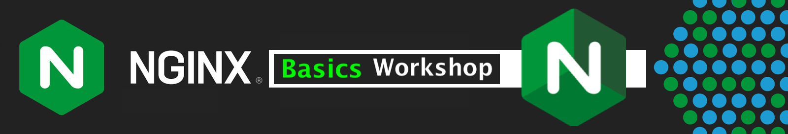
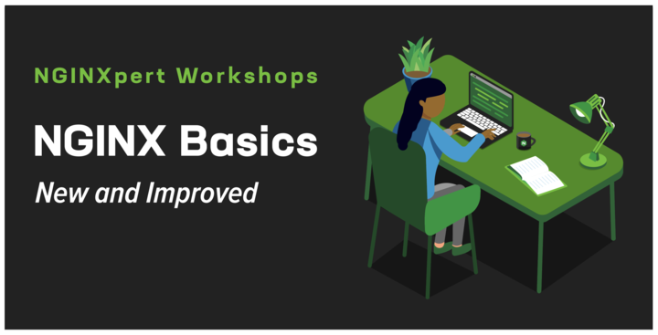

# NGINX Basics Workshop

## NGINX OSS 및 NGINX Plus 101 Workshop에 오신 것을 환영합니다.

<br/>

이번 워크샵에서 우리는 `NGINX 웹서버 및 Reverse Proxy`에 대한 직접 배포를 통한 실습을 위주로 진행을 합니다.

워크샵은 사전 경험이 없더라도 NGINX 오픈소스 소프트웨어(OSS) 및 NGINX 상용버전(Plus)에 대해 배우게 되며, 제공된 실습에서는 일반적인 명령, 도구 및 환경에서 NGINX를 설치, 구성, 테스트, 작동, 문제해결 및 수정하는 방법을 예제로 알려줍니다. 

NGINX에는 수십 가지의 사용 사례가 있으며, 이번 워크샵에서는 신규 사용자 및 배포에 대한 가장 일반적인 사례 중심으로 진행을 합니다. 이 워크샵 컨텐츠는 Docker 및 Linux 컨테이너를 호스팅할 수 있는 거의 모든 환경에서 실행되도록 설계되엊 사용자가 폭넓게 사용하거나 활용할 수 있습니다.

NGINX 웹서버를 구성하고, Docker를 사용하여 배포한 NGINX를 웹서버로 사용하고 기본 및 고급 NGINX 기능을 구성하고, 부하 테스트, 실시간 모니터링 등의 방법들을 배우게 됩니다. 새 앱 및 서비스 배포하고, 


NGINX 웹 서버를 구성하고, 도커와 함께 배포하고, 기본 및 일부 고급 NGINX 기능을 구성하고, 로드 테스트하고, 실시간으로 모니터링하는 방법을 배우게 된다. 새로운 앱과 서비스를 배포하고, SSL을 종료하고, HTTP 트래픽을 라우팅하고, 리디렉션 구성하고, 상태 점검을 설정하고, 실행 중인 서버에 트래픽을 로드 밸런싱한다. 몇 가지 보안 기능을 추가하고, 모범 사례를 따르며, 기본 NGINX 구성에 능숙해진다. 이러한 Hands-On Lab 연습은 독립적으로 설계되었으며, 나중에 실험실에서 추가 서비스와 기능을 추가한다. 실험실을 순차적으로 완료하는 것이 매우 권장된다.

이 워크숍이 끝날 때까지, 여러분은 백엔드 웹 애플리케이션 서버에서 오가는 트래픽을 라우팅하는 NGINX OSS 또는 Plus Docker 환경을 갖게 될 것이며, 여러분 자신의 최신 애플리케이션을 위해 NGINX를 배포하고 운영하는 데 필요한 기술을 갖추게 될 것입니다. 시간을 내어 NGINXpert 워크숍에 참석해 주셔서 감사합니다!



## Goals

- Overview of NGINX History and Architecture
- How to build and setup NGINX OSS and NGINX Plus on Docker
- How to configure NGINX for basic web server functions
- How to configure NGINX for Proxy functions
- How to monitor, log, troubleshoot, and fix common issues
- Provide examples of NGINX configurations best practices
- Provide an overview of NGINX Plus
- Introduction to third party integrations like Prometheus and Grafana
- Introduction to more Advanced Topics

## Prerequisites

To successfully complete the Hands On exercises for this Workshop, there are both knowledge and technical requirements.

### Knowledge Requirements

- You should be familiar with the Linux command line, copying, editing, and saving files.
- You should be familiar with TCP, HTTP, SSL, and basic networking concepts.
- You should be familiar with basic Docker and container commands and concepts.
- You should be familiar with Computer Desktop apps like Chrome, Visual Studio Code, Postman, Terminal.
- Optional, you should be familiar with load balancing concepts and terminology.

### Technical Requirements

The Hands On lab exercises are written for users with a host running multiple Docker containers.  These containers are quite small, and should all run easily on most modern computer hardware.  You will need to provide the following components, prior to starting the exercises:

1. A Docker host, with [Docker](https://docs.docker.com/get-docker/) and [Docker Compose](https://docs.docker.com/compose/install/) installed and running.

2. Admin access to your local computer to install and run various software packages.  See the [prerequisites.md](labs/lab0/prerequisites.md) file within`labs/lab0` folder for details on setting up your computer for this Workshop.

3. Admin access to your local `/etc/hosts` file is also needed. The lab uses the FQDN hostnames: `www.example.com`,`www2.example.com`,`cars.example.com`,`cafe.example.com`. For hostname resolution you will need to add these hostnames to your local DNS hosts file.

   For example, on Linux/macOS the host file is located at `/etc/hosts`:

   ```bash
    # NGINX OSS/Plus Basics lab hostnames (local docker hosts)
    127.0.0.1 example.com www.example.com www2.example.com cars.example.com cafe.example.com
   ```

     > **Note on Docker DNS:**
     >
     > DNS resolution between containers is provided by default using the bridged network by docker networking, and NGINX has been pre-configured to use the Docker internal DNS server (127.0.0.11) to provide DNS resolution between the containers.  Your Docker environment may be different.

4. An NGINX Plus subscription or Trial license will be required to complete the NGINX PLUS lab exercises. You can request a free 30-day Trial from [NGINX Plus Trial](https://www.nginx.com/free-trial-request/).  An email with download links to the license files will normally arrive within a few hours of submitting a request.

### How to use the Lab Guides

To ensure understanding of every step, every line which is to be entered by the user is preceded by `$>`. This is intentional so the user must type and enter each line, instead of bulk copy/paste. It is highly recommended that you type ALL the commands yourself, to facilitate better understanding and retention of this content.  (Insert Mavin typing memory retention study results here).

## The Workshop environment

1. This Workshop is built to only require the user's computer, no servers or VMs are needed.

1. The user's computer, which will host all the Docker containers, and provide a Desktop UI for using various apps, like Chrome, Visual Studio Code, Postman, Terminal.

1. See [prerequisites.md](labs/lab0/prerequisites.md) file within`labs/lab0` folder, for details on installing the required software for your platform.  You will likely need full administrative privleges to properly install and configure the software.

1. As you progress through the lab exercises, you will be adding more containers, and more features and options to NGINX.  **It is important that you complete the lab exercises in the order presented in this Workshop, so that you can see and learn how to configure NGINX properly, and complete all exercises successfully.**

1. The docker containers used are as follows:
   - NGINX Opensource ADC/load balancer, named `nginx-oss`
   - NGINX Plus ADC/load balancer, named `nginx-plus`
   - Web servers #1, 2, and 3; named `web1`, `web2` and `web3` respectively.

1. Further details of the docker containers:

   - **NGINX OSS** `(Latest)` based on Alpine Linux.
   - **NGINX Plus** `(Latest)` based on Debian Linux.
   - **NGINX Web#** `(Latest)` is based on
   [**nginxinc/ingress-demo**](https://hub.docker.com/r/nginxinc/ingress-demo).

     (NGINX web servers that serve simple HTML pages containing the Hostname, IP address and port, request URI, local time, request id, and other metadata.)

1. **Lab Summary page** can be read with a web browser starting at [labs/readme.md](labs/readme.md).

>NOTE:  All the container images are built on your computer, so they will be available `after` the Workshop, so you can use them for further learning, testing and as reference material. All the documentation and sample config files, including the Lab Guides, will also be available on NGINX's `GitHub` repo.  As you make changes to your config files, you will need to make copies or back them up yourself.

### Topology

This is the workshop Docker environment for the lab exercises:

```diagram
                                             (nginx-cafe upstream: 
                                             web1:80, web2:80, web3:80)
                      +---------------+                        
                      |               |       +-----------------+
+-------------------->|               |       |                 |
www.example.com       |               +------>|      web1       |
HTTP/Port 80          |               |       |  (nginx-cafe)   |
                      |               |       |                 |
+-------------------->|               |       +-----------------+
www2.example.com      |               |
HTTP-HTTPS redirect   |               |       +-----------------+
HTTP/Port 80          |  nginx-oss /  |       |                 |
                      |  nginx-plus   +------>|     web2        |                     
+-------------------->|     (ADC)     |       |  (nginx-cafe)   |
cars.example.com      |               |       |                 |
HTTPS/Port 80         |               |       +-----------------+
                      |               |             
+-------------------->|               |       +-----------------+         
cars.example.com      |               |       |                 |
HTTP/Port 443         |               +------>|     web3        | 
                      |               |       |  (nginx-cafe)   |
+-------------------->|               |       |                 |
cafe.example.com      |               |       +-----------------+
HTTP/Port 80          |               |
                      |               |     
+-------------------->|               |        
NGINX Dashboard/      |               | 
API                   |               |
HTTP/Port 9000        |               | 
                      |               |  
                      |               |       
                      +---------------+                                                                                    
```

## Build and run the Workshop environment

Please make sure all the Prerequisites have been met before running the steps below.

### Build the Lab containers

As outlined above, you will have a one NGINX OSS or NGINX Plus ADC/load balancer (`nginx-oss`/`nginx-plus`) and
three NGINX OSS webservers (`web1`, `web2` and `web3`)

If using NGINX Plus ADC/load balancer then before you start the build, you need to copy your NGINX Plus repo key and certificate files
(`nginx-repo.key` and `nginx-repo.crt`) into the proper directory,  `nginx-plus/etc/ssl/nginx/`.  Docker will use these files to download the appropriate NGINX Plus files, then build your stack:

```bash
# Enter working directory (Replace lab x with the lab that you plan to run) 
$> cd nginx-basics/labs/[lab x]

# *Next check only applicable for NGINX Plus related labs (lab 5 onwards)
# Make sure your Nginx Plus repo key and certificate exist here
$> ls nginx-plus/etc/ssl/nginx/nginx-*
nginx-repo.crt              nginx-repo.key

# Downloaded docker images and build
$> docker-compose pull
$> docker-compose build --no-cache
```

-----------------------
> See other other useful [`docker`](labs/useful-docker-commands.md) and
> [`docker-compose`](labs/useful-docker-compose-commands.md) commands

-----------------------

#### Start the Demo stack

Run `docker-compose` in the foreground so you can see real-time log output to the
terminal:

```bash
$> docker-compose up
```

Or, if you made changes to any of the Docker containers or NGINX configurations, run:

```bash
# Recreate containers and start demo
$> docker-compose up --force-recreate
```

**Confirm** all the containers are running by executing below command.

```bash
$> docker ps
```

For NGINX Plus related labs(lab5 onwards), you can access the NGINX API on **HTTP / Port 9000**
([`http://localhost:9000`](http://localhost:9000))

**This completes the Introduction.**

## References

- [NGINX Plus](https://docs.nginx.com/nginx/)
- [NGINX Admin Guide](https://docs.nginx.com/nginx/admin-guide/)
- [NGINX Technical Specs](https://docs.nginx.com/nginx/technical-specs/)
- [NGINX Resources](https://www.nginx.com/resources/)
- [NGINX Blogs](https://www.nginx.com/blog/)
- [Docker](https://www.docker.com/)
- [Docker Compose](https://docs.docker.com/compose/)

### Authors

- Chris Akker - Solutions Architect - Community and Alliances @ F5, Inc.
- Shouvik Dutta - Solutions Architect - Community and Alliances @ F5, Inc.

-----------------------

Click the labs summary readme to get started ([labs/readme.md](labs/readme.md))
