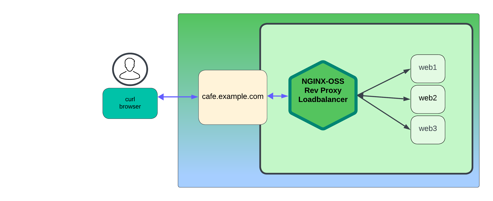
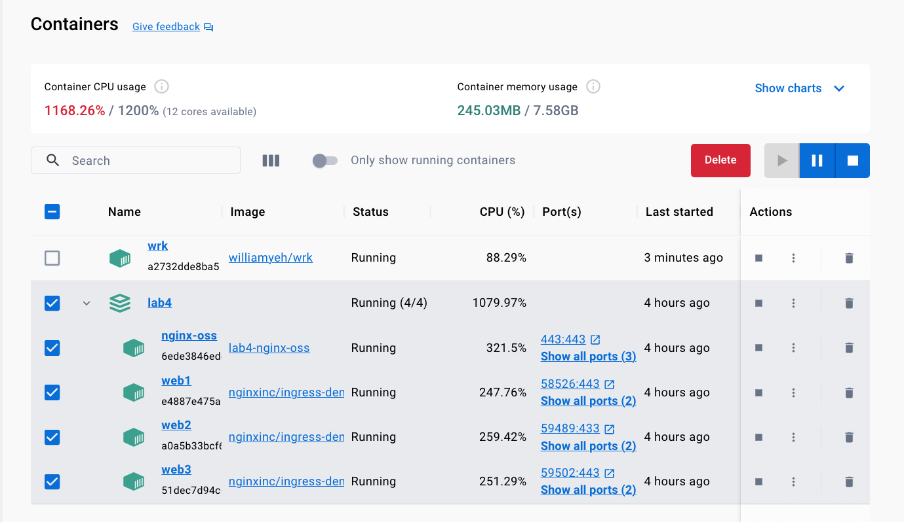

# NGINX Reverse Proxy 및 HTTP Load Balancing

## 소개


이 실습에서는 Docker 및 NGINX를 사용하여 테스트 랩 환경을 구축 합니다. NGINX OSS를 Docker 컨테이너에서 빌드하고 실행한 다음 웹 서버로 사용할 3개의 NGINX 데모 웹 서버를 실행 합니다. 모든 컨테이너가 실행된 후 각 컨테이너, NGINX Proxy 및 웹 서버를 테스트하고 확인 합니다. 

이러한 모든 NGINX 컨테이너는 나머지 실습을 완료하기 위한 학습 플랫폼으로 사용되며, NGINX 컨테이너를 올바르게 빌드하고 실행하여 연습을 완료하고 워크샵을 최대한 활용하는 것이 중요 합니다.

NGINX OSS | Docker
:-------------------------:|:-------------------------:
  |
  
## 학습목표

실습을 마치면 다음을 수행할 수 있습니다:

- `NGINX Opensource Docker` 이미지 빌드 및 실행
- Docker Compose로 워크샵 환경구축
- NGINX 테스트로 컨테이너 빌드확인
- NGINX 확장 엑세스 로깅 구성
- 로드밸런싱 위한 NGINX 구성
- 모범 사례에 따라 NGINX 기능추가

## 전체조건

- Docker가 설치되어 실행 중이어야 합니다
- Docker-Compose가 설치되어 있어야 합니다
- 이 워크샵을 위한 시스템 설정에 대한 지침은 `Lab0`을 참조하십시오
- 기본 Linux 명령 및 CLI 도구에 대한 지식
- 기본 Docker 개념 및 명령에 대한 지식
- 기본 HTTP 프로토콜에 대한 지식

## Docker Compose를 사용하여 워크샵 환경구축


이 실습에서는 4개의 Docker 컨테이너를 빌드/실행 합니다. 첫번째는 NGINX OSS Reverse Prpoxy로 사용하되고 나머지 3개는 업스트림 백엔드 웹 서버로 사용 됩니다.



### NGINX OSS Docker 빌드 매개변수 구성

1. `labs/lab4/nginx-oss` 폴더에 있는 Dockerfile을 검사 합니다. build 매개변수는 이미지를 사용하며, 이미지에 추가 도구 라이브러리를 설치하는 명령도 사용 합니다. 이러한 도구는 파일을 복사/편집하고 연습에서 컨테이너를 사용하는 동안 다양한 테스트를 실행하는데 필요 합니다. 참고: 원하는 경우 다른 NGINX 기본 이미지를 선택할 수 있지만 이번 실습은 Alpine 이미지(mainline)를 사용하도록 작성 되었습니다.

    ```bash
    FROM nginx:mainline-alpine
    RUN apk add --no-cache curl ca-certificates bash bash-completion jq wget vim

    ```

1. `labs/lab4` 폴더에 있는 `docker-compose.yml` 파일을 검사 합니다. NGINX OSS 웹 및 프록시 컨테이너를 빌드하고 실행하고 있습니다. (이전 단계에서 수정된 항목 `/nginx-oss/Dockerfile` 사용)

    ```bash
    ...
    nginx-oss:                  # NGINX OSS Web / Load Balancer
        hostname: nginx-oss
        build: nginx-oss          # Build new container, using /nginx-oss/Dockerfile
        volumes:                  # Sync these folders to container
            - ./nginx-oss/etc/nginx/nginx.conf:/etc/nginx/nginx.conf
            - ./nginx-oss/etc/nginx/conf.d:/etc/nginx/conf.d
            - ./nginx-oss/etc/nginx/includes:/etc/nginx/includes
        links:
            - web1:web1
            - web2:web2
            - web3:web3
        ports:
            - 80:80       # Open for HTTP
            - 443:443     # Open for HTTPS
            - 9000:9000   # Open for stub status page
        restart: always 

    ```


    또한 `docker-compose.yml`의 Docker Hub의 이미지를 사용하여 3개의 Docker NGINX 웹 서버 컨테이너를 실행 합니다. 이 3개의 NGINX 웹 서버는 연습을 위한 업스트림(백엔드 웹 서버)가 될 것 입니다.

    ```bash
    ...
    web1:
        hostname: web1
        image: nginxinc/ingress-demo       # Image from Docker Hub
        ports:
            - "80"                           # Open for HTTP
            - "443"                          # Open for HTTPS
    web2:
        hostname: web2
        image: nginxinc/ingress-demo
        ports:
            - "80"
            - "433"
    web3:
        hostname: web3
        image: nginxinc/ingress-demo
        ports:
            - "80"
            - "443"   

    ```

1. `lab4` 폴더에 있는지 확인 후 작업을 진행 합니다. 터미널을 사용하여 Docker Compose를 실행하여 컨테이너를 빌드하고 실행 합니다.

   ```bash
    cd lab4
    docker compose up --force-recreate -d
   ```

1. 아래와 같이 4개의 컨테이너가 정상적으로 실행 중인지 확인 합니다.

    ```bash
    docker ps -a

    ```

    ```bash
    ##Sample output##
    CONTAINER ID   IMAGE                   COMMAND                  CREATED       STATUS       PORTS                                                              NAMES
    6ede3846edc3   lab4-nginx-oss          "/docker-entrypoint.…"   3 hours ago   Up 3 hours   0.0.0.0:80->80/tcp, 0.0.0.0:443->443/tcp, 0.0.0.0:9000->9000/tcp   nginx-oss
    e4887e475a14   nginxinc/ingress-demo   "/docker-entrypoint.…"   3 hours ago   Up 3 hours   0.0.0.0:56086->80/tcp, 0.0.0.0:56087->443/tcp                      web1
    a0a5b33bcf68   nginxinc/ingress-demo   "/docker-entrypoint.…"   3 hours ago   Up 3 hours   443/tcp, 0.0.0.0:56084->80/tcp, 0.0.0.0:56085->433/tcp             web2
    51dec7d94c6f   nginxinc/ingress-demo   "/docker-entrypoint.…"   3 hours ago   Up 3 hours   0.0.0.0:56082->80/tcp, 0.0.0.0:56081->443/tcp                      web3

    ```

1. 3개의 웹 서버가 모두 정상 동작하고 있는지 확인 합니다. 터미널을 사용하여 `web1`, `web2`, 그리고 `web3` 각 컨테이너가 모두 curl 요청에 대한 응답을 받는지 확인 합니다.

    ```bash
    docker exec -it web1 bin/sh   # log into web1 container, then web2, then web3

    ```

    ```bash
    curl -s http://localhost |grep Name

    ```

    ```bash
    ##결과예시##

    <p class="smaller"><span>Server Name:</span> <span>web1</span></p>   # web1

    <p class="smaller"><span>Server Name:</span> <span>web2</span></p>   # web2

    <p class="smaller"><span>Server Name:</span> <span>web3</span></p>   # web3

    ```

    확실하게 하가위해 3대의 웹 서버 모두 확인을 진행 합니다. 컨테이너 터미널 내에서 확인 후 완료되면 `exit`를 입력하여 Docker Exec를 종료 합니다. 

1. 그리고 NGINX OSS 컨테이너도 동일하게 curl 요청에 대한 응답을 제공하는지 확인 합니다. 

    ```bash
    docker exec -it nginx-oss bin/sh   # log into nginx-oss container

    ```

    ```bash
    curl http://localhost

    ```

    ```bash
    ##결과예시##
   <!DOCTYPE html>
    <html>
    <head>
    <title>Welcome to nginx!</title>
    
    ...snip

    <p><em>Thank you for using nginx.</em></p>
    </body>
    </html>

    ```

    축하합니다! - `Welcome to nginx!` 페이지가 보이면 정상적으로 확인이 된 것 입니다. `exit`를 입력하여 Docker Exec를 종료 합니다. 

<br/>

### NGINX Status 페이지
<br/>

NGINX에서 다음과 같이 NGINX를 통해 처리되는 트래픽에 대한 몇 가지 기본 메트릭을 보여주는 상태 페이지도 포함되어 있습니다. 
    - Active Connections
    - Connections Accepted, Handled
    - Total number of Requests
    - Reading, writing, and waiting counters.

이 상태 페이지는 NGINX가 트래픽을 정상적으로 처리하고 있는가를 확인할 때 유용 합니다. 

1. `/etc/nginx/conf.d`폴더에 있는 `stub_status.conf` 설정 파일을 확인 합니다.  이 설정 파일에서 우리는 NGINX가 9000 포트에서 수신 대기 중이고 `/basic_status` URL을 사용하는 것을 알 수 있습니다. 이는 트래픽을 모니터링하기 위해 제공되었으며, [References] 섹션에서 `stub_status module`에 대한 자세한 정보가 포함된 링크가 있습니다.

    ```nginx
    # ngx_http_stub_status_module (available in NGINX OSS)
    # provides Basic Status information

    server {
        listen 9000;              # Listener for Stub Status
        
        location /basic_status {
            stub_status;
        }

        # Redirect requests for "/" to "/basic_status"
        location / {
            return 301 /basic_status;
        }
    }

    ```

1. TCP 포트 9000번 포트를 통해 NGINX `stub_status` 페이지를 확인해보세요:

    ```bash
    curl http://localhost:9000/basic_status

    ```

    ```bash
    ##Sample output##
    Active connections: 1
    server accepts handled requests
    56 56 136
    Reading: 0 Writing: 1 Waiting: 0

    ```

1. 그리고 브라우저를 통해서도 <http://localhost:9000/basic_status>를 함께 확인해보세요. 이는 아래와 같은 결과를 확인할 수 있습니다

    

<br/>

### NGINX Reverse Proxy

<br/>

이제 NGINX Welcome 페이지 및 basic_status 페이지를 포함한 4개의 컨테이너가 모두 정상적으로 동작하는 것을 확인하였으므로 **NGINX OSS 프록시 및 로드밸런싱 기능**을 빌드라고 테스트 할 수 있습니다. `proxy_pass`라는 새로운 NGINX 지시문을 사용해볼 차례 입니다. Reverse Proxy 구성으로 시작하여 테스트한 다음 업스트림 백엔드를 추가고 3대의 웹 서버로 부하 분산을 테스트 합니다. 


이전 실습 환경을 사용하고 `cafe.example.com` 웹 사이트에 대한 새 NGINX 구성을 설정 합니다. Lab3의 `cars.example.com.conf`의 설정과 매우 유사합니다.  

이를 위해서는 서버블록(server) 및 위치블록(location)에 대한 새 NGINX 구성 파일이 필요 합니다. 아래 단계에 따라 새 구성 파일을 만듭니다. 

1. `labs/lab4/nginx-oss/etc/nginx/conf.d`폴더로 이동. 이 폴더는 컨테이너에 볼륨이 탑재된 NGINX HTTP 구성 파일의 기본 폴더 입니다. 

1. 이 폴더에서, `cafe.example.com.conf`라는 새 파일을 생성 합니다. 이 파일은 새 웹 사이트의 서버블록 및 위치블록에 대한 구성 파일이 됩니다.  

    그러나 디스크에 HTML 컨텐츠가 있는 폴더를 가르키는 Location 블록 대신 `proxy_pass`를 통해 NGINX에 3개의 웹 컨테이너 중 하나에 대한 요청을 지시 합니다.   

    >이제 NGINX의 놀라운 힘을 잠금해제하는 방법을 보여줄 것 입니다...
    >>자체 컨텐츠를 제공하거나,
    >>> 또는 **다른 웹 서버의 컨텐츠를 제공할 수도 있습니다!**

1. Type in the below commands within `cafe.example.com.conf`파일 내에서 아래의 명령을 입력 합니다. 아래 예시 줄을 복사/붙여넣기 하지 마시고 손으로 직접 입력하여 방법을 학습하시기 바랍니다.

    ```nginx
    # cafe.example.com HTTP
    # NGINX Basics Workshop
    # Feb 2024, Chris Akker, Shouvik Dutta
    #
    server {
        
        listen 80;      # Listening on port 80 on all IP addresses on this machine

        server_name cafe.example.com;   # Set hostname to match in request

        access_log  /var/log/nginx/cafe.example.com.log main; 
        error_log   /var/log/nginx/cafe.example.com_error.log info;

        location / {
            
            # New NGINX Directive, "proxy_pass", tells NGINX to proxy traffic to another server.
            
            proxy_pass http://web1;        # Send requests to web1
        }

    } 
    
    ```

1. 파일을 생성한 후 Docker Exec를 통해 nginx-oss 컨테이너에 저장 합니다. 

   ```bash
    docker exec -it nginx-oss bin/bash
    ```

1. `labs/lab4/nginx-oss/etc/nginx/conf.d` 폴더는 `nginx-oss` 컨테이너의 볼륨으로 마운트되어 있기 때문에 해당 폴더에 새로운 파일이 생성되면 자동으로 nginx-oss 컨테이너의 `/etc/nginx/conf.d` 폴더에도 나타나야 합니다.

1. 컨테이너 내에서 `nginx -t` 그리고 `nginx -s reload` 명령을 각각 실행하여 NGINX 설정을 테스트하고 다시 로드 합니다.

1. curl 명령을 여러 번 실행하여 Proxy_Pass가 정상적으로 동작하는지 테스트하고 브라우저를 통해서도 테스트를 진행 합니다. 

    ```bash
    # Run curl from outside of container
    curl -s http://cafe.example.com |grep Server
    ```

    ```bash
     ##결과예시##
      
     #Run 1
      Server: nginx/1.25.4
      <p class="smaller"><span>Server Name:</span> <span>web1</span></p>   # web1
      <p class="smaller"><span>Server Address:</span> <span><font color="green">172.28.0.4:80</font></span></p>
      
     #Run 2
      Server: nginx/1.25.4
      <p class="smaller"><span>Server Name:</span> <span>web1</span></p>   # web1
      <p class="smaller"><span>Server Address:</span> <span><font color="green">172.28.0.4:80</font></span></p>

     #Run 3
      Server: nginx/1.25.4
      <p class="smaller"><span>Server Name:</span> <span>web1</span></p>   # web1
      <p class="smaller"><span>Server Address:</span> <span><font color="green">172.28.0.4:80</font></span></p>

    ```

    마찬가지로 브라우저에서도 새로고침을 web1 서버의 "품절(out of stock)"결과가 표시되어야 합니다. 원하는 경우 `proxy_pass`를 `web2` 또는 `web3`로 변경하고 어떤 일이 발생하는가를 확인 합니다.

    >이 설정은 `Direct proxy_pass`라고 하며, NGINX에 받은 요청을 다른 서버로 프록시하도록 지시 합니다. FQDN 이름 또는 proxy_pass와 함께 IP:PORT를 사용할 수도 있습니다. 이 실습 환경에서 Docker는 web1에 대한 IP를 제공합니다.

1. 공용 웹 사이트 앞단에서 proxy_pass를 사용할 수도 있습니다. 세부 내용은 `nginx.org`를 통해 더 많은 정보를 확인할 수 있습니다. 데스크탑에서 Docker 컨테이너를 사용하여 다른 사람의 웹 사이트 또는 다른 웹 사이트로 쉽게 전환하는 것이 쉬울까요? 아니요! 그렇게 쉬울 수 없을 겁니다. 하지만 NGINX의 proxy_pass를 사용하면 쉽게 만들 수 있습니다. 

1. 동일한 폴더(`labs/lab4/nginx-oss/etc/nginx/conf.d`)내에 있는 `cafe.example.com.conf`을 업데이트하고 아래 구성 스니펫과 같이 지시문을 변경하십시오. 

    ```nginx
    # cafe.example.com HTTP
    # NGINX Basics Workshop
    # Feb 2024, Chris Akker, Shouvik Dutta
    #
    server {
        
        listen 80;      # Listening on port 80 on all IP addresses on this machine

        server_name cafe.example.com;   # Set hostname to match in request

        access_log  /var/log/nginx/cafe.example.com.log main; 
        error_log   /var/log/nginx/cafe.example.com_error.log info;

        location / {
            
            # New NGINX Directive, "proxy_pass", tells NGINX to proxy traffic to another website.
            

            proxy_pass http://nginx.org;    # Send all requests to nginx.org website 
        }
    } 
    
    ```

1. 파일의 내용이 업데이트되고 저장되면 Docker Exec를 nginx-org 컨테이너에 넣습니다(이 부분은 로컬 볼륨을 사용하기 때문에 자동으로 업데이트가 됩니다. 이 랩에서는 별도로 업데이트할 필요가 없습니다).

   ```bash
    docker exec -it nginx-oss bin/bash
    ```

1. 컨테이너 내에서 각각 `nginx -t` 및 `nginx -s reload` 명령을 실행하여 NGINX 구성을 테스트하고 다시 로드 합니다. 
```bash
    nginx -t; nginx -s reload
```

1. 이제 브라우저를 열고 <http://cafe.example.com>를 입력 후 결과를 확인 합니다. NGINX는 사용자의 요청을 아주 쉽게 nginx.org로 proxy하는 것을 직접 확인할 수 있습니다. 어때요? 굉장하지 않나요??

    

<br/>

### NGINX 로드밸런싱

<br/>

이전 랩에서 `proxy_pass`를 통해 하나의 백엔드 웹 서버에 대해서 동작하는 것을 볼 수 있었지만 다른 2개의 백엔드는 어떻게 추가할 수 있을까요? 웹 사이트에 대한 고가용성 및 증가된 용량이 필요하십니까? 이를 위해 여러 백엔드를 사용하고 로드밸런싱을 설정하려고 합니다. 간단하게 2가지 구성 변경만하면 매우 쉽게 바로 적용을 할 수 있습니다.

- 업스트립 블록 설정을 위한 새로운 .conf 파일의 생성
- 정의된 업스트림 블록을 사용하도록 proxy_pass를 수정

시작해볼까요?<br>
이제 NGINX 프록시에서 `NGINX Upstream Block`을 에 `backend 서버들을 설정`하여 로드밸런싱 요청을 사용할 수 있도록 구성 합니다. 

1. 마운트된 폴더(`labs/lab4/nginx-oss/etc/nginx/conf.d`)에 web1, web2 및 web3의 세가지 백엔드가 있는 업스트림 블록의 구성 파일이 될 `upstream.conf` 이름의 새 설정 파일을 생성 합니다. 새 파일에 아래의 설정을 동일하게 입력 합니다.

    ```nginx
    # NGINX Basics, OSS Proxy to three upstream NGINX containers
    # Chris Akker, Shouvik Dutta - Feb 2024
    #
    # nginx_cafe servers

    upstream nginx_cafe {         # Upstream block, the name is "nginx_cafe"

        # Load Balancing Algorithms supported by NGINX
        # - Round Robin (Default if nothing specified)
        # - Least Connections
        # - IP Hash
        # - Hash (Any generic Hash)     

        # Uncomment for Least Connections algorithm      
        # least_conn;

        # From Docker-Compose:
        server web1:80;
        server web2:80;
        server web3:80;

        #Uncomment for IP Hash persistence
        # ip_hash;

        # Uncomment for keepalive TCP connections to upstreams
        # keepalive 16;

    }

    ```

1. `upstreams.conf`이름으로 파일을 저장 합니다.

1. `cafe.example.com.conf`파일의 `proxy_pass` 지시문을 수정하여 `nginx_cafe`에 호출된 블록에 대한 요청을 프록시 합니다. 다양한 백엔드에 대한 수백, 수천개의 업스트림 블록을 가질 수 있지만 블록 이름은 고유해야 합니다. 

    ```nginx
    # cafe.example.com HTTP
    # NGINX Basics Workshop
    # Feb 2024, Chris Akker, Shouvik Dutta
    #
    server {
        
        listen 80;      # Listening on port 80 on all IP addresses on this machine

        server_name cafe.example.com;   # Set hostname to match in request

        access_log  /var/log/nginx/cafe.example.com.log main; 
        error_log   /var/log/nginx/cafe.example.com_error.log info;

        root /usr/share/nginx/html;         # Set the root folder for the HTML and JPG files

        location / {
            
            # Change the "proxy_pass" directive, tell NGINX to proxy traffic to the upstream block.  
            # If there is more than one server, they will be load balanced
            
            proxy_pass http://nginx_cafe;        # Must match the upstream block name
        }

    } 
    
    ```

1. 해당 설정으로 파일을 업데이트 후 Docker Exec를 통해 해당 NGINX 컨테이너에 접속 합니다. 

   ```bash
    docker exec -it nginx-oss bin/bash
    ```

1. `nginx -t` 및 `nginx -s reload`명령을 통해 NGINX 설정에 대한 검사와 리로드를 수행 합니다.  

1. `cafe.example.com`가 설정된 업스트림 블록으로 정상적인 로드밸런싱이 수행하는가를 확인 합니다. 정상적으로 동작하면 설정된 3대의 웹 서버로 로드밸런싱이 되는 것을 확인할 수 있습니다. 

    ```bash
    # Run curl from outside of container
    curl -is http://cafe.example.com |grep Server     # run at least 3 times

    ```

    ```bash
     ##Sample output##

     # Run1
      Server: nginx/1.25.4
      <p class="smaller"><span>Server Name:</span> <span>web1</span></p>   # web1
      <p class="smaller"><span>Server Address:</span> <span><font color="green">172.28.0.4:80</font></span></p>

     # Run2
      Server: nginx/1.25.4
      <p class="smaller"><span>Server Name:</span> <span>web2</span></p>   # web2
      <p class="smaller"><span>Server Address:</span> <span><font color="green">172.28.0.3:80</font></span></p>

     # Run3
      Server: nginx/1.25.4
      <p class="smaller"><span>Server Name:</span> <span>web3</span></p>   # web3
      <p class="smaller"><span>Server Address:</span> <span><font color="green">172.28.0.2:80</font></span></p>

    ```

    결과를 통해 우리는 `Server Names`에 `web1`, `web2`, 그리고 `web3` 3개의 웹 컨테이너가 모두 NGINX를 통해 로드밸런싱되어 로드밸런싱 및 Reverse Proxy하는 것을 확인할 수 있습니다. 각 업스트림 컨테이너의 IP 주소 및 이름을 확인하면 됩니다. 참고: IP 주소는 환경에 따라 다를 수 있습니다.

1. 이제 브라우저를 이용하여 동일한 URL에 대한 확인을 진행 합니다. 3번 이상 `Refresh`하여 결과를 확인하면 됩니다. 

    브라우저를 통해 http://cafe.example.com 주소로 이동합니다.

    우리는 `Out of Stock` 웹 페이지 및 `Server Name` 및 `Server Addresses`를 각각 확인할 수 있습니다.

    NGINX Web1 | NGINX Web2 | NGINX Web3 
    :-------------------------:|:-------------------------:|:-------------------------:
      | |

>우리는 이 설정을 `Upstream proxy_pass`라고하며, 여기서 NGINX에 업스트림의 서버 목록에 대한 요청을 프록시하고 로드밸런싱하도록 지시 합니다.

1. 현재 실습 환경의 백엔드는 `/`경로 외 아래와 같은 다양한 페이지가 설정되어 있기 때문에 자유롭게 확인할 수 있습니다:
   - [http://cafe.example.com/coffee](http://cafe.example.com/coffee)
   - [http://cafe.example.com/tea](http://cafe.example.com/tea)
   - [http://cafe.example.com/icetea](http://cafe.example.com/icetea)
   - [http://cafe.example.com/beer](http://cafe.example.com/beer)
   - [http://cafe.example.com/wine](http://cafe.example.com/wine)
   - [http://cafe.example.com/cosmo](http://cafe.example.com/cosmo)
   - [http://cafe.example.com/mojito](http://cafe.example.com/mojito)
   - [http://cafe.example.com/daiquiri](http://cafe.example.com/daiquiri)

<br/>

### NGINX 확장 엑세스 로깅

<br/>

이제 잘 동작하는 NGINX 프록시와 여러 백엔드가 있으므로 추가 NGINX 지시문, 변수를 활용하여 프록시 트래픽에 대한 엑세스 로그에 더 많은 정보를 출력해보도록 하겠습니다. 기본 NGINX `main` 엑세스 log_format에는 필요한 정보의 일부만 포함되어 있으므로 업스트림 백엔드 서버에 대한 더 많은 `extend` 정보를 포함해야 할 수도 있습니다. 


1. 이번 실습에서는 추가적인 $variables를 통해 새 메타데이터를 access_log에 설정하여 `log_format`을 정의할 수 있습니다. 

1. NGINX를 설치할 때 기본값인 `main` 엑세스로 로그 포맷(log_format)를 `/etc/nginx/nginx.conf`을 통해 확인 합니다. 이 로그 형식에는 업스트림, 해더 또는 기타 필요한 세부 정보 등이 없습니다. 

    ```nginx
    ...snip from /etc/nginx/nginx.conf

    log_format  main  '$remote_addr - $remote_user [$time_local] "$request" '
                    '$status $body_bytes_sent "$http_referer" '
                    '"$http_user_agent" "$http_x_forwarded_for"';

                    # 어떻게 백엔드 서버가 트래픽을 처리했는가에 대한 업스트림 정보는 없습니다. 

    ...

    ```

1. `/etc/nginx/includes/log_formats`폴더에 있는 `main_ext.conf` 파일을 열어서 확인 합니다. 많은 추가 $variables가 있음을 확인할 수 있고 일부는 요청용, 일부는 프록시 기능용, 일부는 응답용, 일부는 업스트림에 대한 것이 있습니다.(따라서 어떤 백엔드가 선택되고 사용되었는지 알 수  있습니다) NGINX에는 보고싶은 내용에 따라 사용할 수 있는 다양한 `수백가지의` $variables가 있습니다.

    ```nginx
    # Extended Log Format
    # Nginx Basics
    log_format  main_ext    'remote_addr="$remote_addr", '
                            '[time_local=$time_local], '
                            'request="$request", '
                            'status="$status", '
                            'http_referer="$http_referer", '
                            'body_bytes_sent="$body_bytes_sent", '
                            'Host="$host", '
                            'sn="$server_name", '
                            'request_time=$request_time, '
                            'http_user_agent="$http_user_agent", '
                            'http_x_forwarded_for="$http_x_forwarded_for", '
                            'request_length="$request_length", '
                            'upstream_address="$upstream_addr", '
                            'upstream_status="$upstream_status", '
                            'upstream_connect_time="$upstream_connect_time", '
                            'upstream_header_time="$upstream_header_time", '
                            'upstream_response_time="$upstream_response_time", '
                            'upstream_response_length="$upstream_response_length", ';
                            
    ```

1. 다음 몇 가지 실습에서 확장 log_format을 사용해보려고 합니다. 마운트된 폴더(`labs/lab4/nginx-oss/etc/nginx/conf.d`)의 `cafe.example.com.conf`설정 파일을 업데이트하여 `main_ext`로그 형식을 사용합니다.

    ```nginx
    # cars.example.com HTTP
    # NGINX Basics Workshop
    # Feb 2024, Chris Akker, Shouvik Dutta
    #
    server {
        
        listen 80;      # Listening on port 80 on all IP addresses on this machine

        server_name cafe.example.com;   # Set hostname to match in request

        access_log  /var/log/nginx/cafe.example.com.log main_ext;         # Change this to "main_ext"
        error_log   /var/log/nginx/cafe.example.com_error.log info;

    ...snip

    ```

1. 설정 파일이 업데이트되고 저장되면 Docker Exec를 통해 nginx-oss로 접속 합니다.

   ```bash
    docker exec -it nginx-oss bin/bash
    ```

1. `nginx -t` 및 `nginx -s reload` 명령으로 NGINX 구성을 테스트하고 다시 로드 합니다.

1. NGINX-OSS 컨테이너로 접속 후 `/var/log/nginx/cafe.example.com.log` 엑세스 로그 파일을 추적하면 새로운 확장 로그 형식 기반의 로그가 표시 됩니다.

    ```bash
    docker exec -it nginx-oss bin/bash
    tail -f /var/log/nginx/cafe.example.com.log

    ```

1. curl 명령으로 `cafe.example.com`로 몇번 접속 시도 후 확장된 로그의 내용을 확인 합니다.

    아래와 같이 표시되어야 합니다(아래 내용은 명확성을 보여주기 위해 주석 및 줄바꿈을 추가함):

    ```bash
     ##Sample output##

     # Raw Output
     remote_addr="192.168.65.1", [time_local=19/Feb/2024:19:14:32 +0000], request="GET / HTTP/1.1", status="200", http_referer="-", body_bytes_sent="651", Host="cafe.example.com", sn="cafe.example.com", request_time=0.001, http_user_agent="Mozilla/5.0 (Macintosh; Intel Mac OS X 10_15_7) AppleWebKit/537.36 (KHTML, like Gecko) Chrome/121.0.0.0 Safari/537.36", http_x_forwarded_for="-", request_length="471", upstream_address="172.18.0.3:80", upstream_status="200", upstream_connect_time="0.000", upstream_header_time="0.000", upstream_response_time="0.000", upstream_response_length="651",

     # Formatted output with Line Breaks to make it more readable
     remote_addr="192.168.65.1", 
     [time_local=19/Feb/2024:19:14:32 +0000], 
     request="GET / HTTP/1.1", status="200", 
     http_referer="-", 
     body_bytes_sent="651", 
     Host="cafe.example.com", 
     sn="cafe.example.com", 
     request_time=0.001, 
     http_user_agent="Mozilla/5.0 (Macintosh; Intel Mac OS X 10_15_7) AppleWebKit/537.36 (KHTML, like Gecko) Chrome/121.0.0.0 Safari/537.36", 
     http_x_forwarded_for="-", 
     request_length="471",
     upstream_address="172.18.0.3:80", # Nice, now you know what backend was selected
     upstream_status="200", 
     upstream_connect_time="0.000", 
     upstream_header_time="0.000", 
     upstream_response_time="0.000", upstream_response_length="651",   

    ```

    위와 같이 NGINX에는 필요에 맞게 access log_format을 `many $variables`을 포함하여 사용자 지정으로 사용할 수 있습니다. NGINX 엑세스 로깅에 대한 모든 변수는 [References](#references) 링크를 통해 확인 할 수 있습니다.  
    또한 다른 호스트, 서버 블록 또는 다른 위치 블록에 대한 다른 로그 형식 또한 사용할 수 있으며 하나의 log_format로 제한되지 않는다는 점도 알고 있어야 합니다.

<br/>

### NGINX 프로시프로토콜(ProxyProtocol) 및 연결유지(Keepalive)

<br/>

여기까지 우리는 Reverse Proxy 및 로드밸런싱이 동작하는 것을 확인하였고 이제는 NGINX와 백엔드 서버간의 주고 받아야 하는 정보에 대해 한번 살펴보도록 하겠습니다. 결국 클라이언트와 서버 사이에 프록시를 삽입하면 요청 또는 응답에서 중요한 정보가 손실될 수 있습니다. 이러한 정보를 `NGINX proxy_headers`를 사용하여 복원하고 추가 정보를 삽입하는데 활용할 수 있습니다. 프록시 해더는 HTTP 프로토콜 자체를 제어하는데도 사용될 수 있습니다.

이번 실습에서는 이러한 HTTP 프로토콜 해더를 정의한 다음 NGINX에서 `cafe.example.com`의 서버 블록에서 사용하도록 지시하여 모든 요청 및 응답에 새롭게 정의한 해더가 포함되도록 합니다.   

**메모:** NGINX는 업스트림에 요청을 프록시할 때 레거시 호환성을 위해 기본적으로 HTTP/1.0 프로토콜을 사용합니다.  

기본 설정인 HTTP/1.0 프로토콜은 모든 요청에 대해 새로운 TCP 연결을 생성하여 사용하기 때문에 매우 비효율적 입니다. 최신의 앱들은 대부분 HTTP/1.1을 지원하기 때문에 NGINX 프록시 요청에 HTTP/1.1을 사용하도록 지시하여 NGINX가 여러 요청에 TCP 연결을 재사용할 수 있도록 합니다. 이는 일반적으로 HTTP Keepalive 또는 HTTP Pipelining 이라고 합니다.

1. `labs/lab4/nginx-oss/etc/nginx/includes` 폴더에 `keepalive.conf` 파일의 설정을 확인 합니다. HTTP/1.1이 올바르게 동작하는데 필요한 3가지 지시문과 해더가 있습니다.

    - HTTP Protocol =  `$proxy_protocol_version`변수를 사용하여 1.1로 설정 합니다.
    - HTTP Connection Header = 공백으로 둡니다, `""`, 기본값은 `Close`이고 요청 후 연결을 종료하는 설정 입니다.
    - HTTP Host = HTTP/1.1 protocol은 `$host` Host 해더를 설정해야 합니다.

    ```nginx
    #Nginx Basics - Feb 2024
    #Chris Akker, Shouvik Dutta
    #
    # Default is HTTP/1.0 to upstreams, HTTP keepalives needed for HTTP/1.1
    proxy_http_version 1.1;

    # Set the Connection header to empty 
    proxy_set_header Connection "";

    # Host request header field, or the server name matching a request
    proxy_set_header Host $host;

    ```

1. `labs/lab4/nginx-oss/etc/nginx/conf.d` 폴더의 `cafe.example.com.conf`파일의 설정에서 업스트림 서버와 통신에서 HTTP/1.1 프로토콜을 사용하도록 `include` 지시문을 사용하여 업데이트 합니다.

    ```nginx
    # cafe.example.com HTTP
    # NGINX Basics Workshop
    # Feb 2024, Chris Akker, Shouvik Dutta
    #
    server {
        
        listen 80;      # Listening on port 80 on all IP addresses on this machine

        server_name cafe.example.com;   # Set hostname to match in request

        access_log  /var/log/nginx/cafe.example.com.log main; 
        error_log   /var/log/nginx/cafe.example.com_error.log info;

        root /usr/share/nginx/html;         # Set the root folder for the HTML and JPG files

        location / {
            
            # Uncomment to enable HTTP keepalives

            include includes/keepalive.conf;     # Use HTTP/1.1 keepalives
            
            proxy_pass http://nginx_cafe;        # Proxy AND load balance to a list of servers
        }

    } 
    ```

1. 파일의 내용이 수정되고 업데이트되면 Docker Exec를 통해 nginx-oss 컨테이너로 접속 합니다.

   ```bash
    docker exec -it nginx-oss bin/bash
    ```

1. 컨테이너 내에서 `nginx -t` 및 `nginx -s reload` 명령으로 설정을 검사하고 다시 로드 합니다.

1. curl 명령을 사용하여 웹 사이트에 요청을 보내고 다시 전송된 해더를 확인 합니다.

    ```bash
    # Run curl from outside of container
    curl -I http://cafe.example.com

    ```

    ```bash
    ##Sample output##
    HTTP/1.1 200 OK                          # protocol version is 1.1
    Server: nginx/1.25.4
    Date: Sat, 17 Feb 2024 01:41:01 GMT
    Content-Type: text/html; charset=utf-8
    Connection: keep-alive                   # Connection header = keep-alive
    Expires: Sat, 17 Feb 2024 01:41:00 GMT
    Cache-Control: no-cache

    ```

1. 그리고 브라우저를 사용해서 "개발자도구" 또는 "Inspect" 옵션을 열어 브라우저의 디버깅 메타데이터를  볼 수 있습니다. <http://cafe.example.com> 웹사이트를 방문하고 개발자 도구의 네트워크 탭을 클릭한 다음 첫번째 개체를 클릭하면 Request 및 Response 해더가 표시되며 `Connection:` = `keep-alive` 내용을 확인할 수 있습니다.

    

<br/>

### NGINX 사용자지정 요청해더

<br/>

Now you need to enable some HTTP Headers, to be added to the Request.  These are often need to relay information between the HTTP client and the backend server. These Headers are in addition to the HTTP Protocol control headers.

1. Inspect the `proxy_headers.conf` in the `labs/lab4/nginx-oss/etc/nginx/includes` folder.  You will see that some custom HTTP Headers are being added.

    ```nginx
    #Nginx Basics - Feb 2024
    #Chris Akker, Shouvik Dutta
    #
    ## Set Headers to the proxied servers ##

    # client address in binary format
    proxy_set_header X-Real-IP $remote_addr;

    # X-Forwarded-For client request header 
    proxy_set_header X-Forwarded-For $proxy_add_x_forwarded_for;

    # request scheme, “http” or “https”
    proxy_set_header X-Forwarded-Proto $scheme;

    ```

1. Update your `cafe.example.com.conf` file within your mounted folder (`labs/lab4/nginx-oss/etc/nginx/conf.d`) to use the `proxy_headers.conf` added to the config using an `include` directive:

    ```nginx
    # cafe.example.com HTTP
    # NGINX Basics Workshop
    # Feb 2024, Chris Akker, Shouvik Dutta
    #
    server {
        
        listen 80;      # Listening on port 80 on all IP addresses on this machine

        server_name cafe.example.com;   # Set hostname to match in request

        access_log  /var/log/nginx/cafe.example.com.log main; 
        error_log   /var/log/nginx/cafe.example.com_error.log info;

        root /usr/share/nginx/html;         # Set the root folder for the HTML and JPG files

        location / {
            
            # Uncomment to enable custom headers and HTTP keepalives

            include includes/proxy_headers.conf; # Add Request Headers

            include includes/keepalive.conf;     # Use HTTP/1.1 and keep-alives
            
            proxy_pass http://nginx_cafe;        # Proxy AND load balance to a list of servers
        }

    } 
    ```

1. Once the content of the file has been updated and saved, Docker Exec into the nginx-oss container.

   ```bash
    docker exec -it nginx-oss bin/bash
    ```

1. Test and reload your NGINX config by running `nginx -t` and `nginx -s reload` commands respectively from within the container.

<br/>

### NGINX Load Balancing Algorithms and Load Testing

<br/>

Different backend applications may benefit from using different load balancing techniques.  NGINX support both legacy and more modern algorithms for different use cases.  You will configure and test several of these algorithms, put them under a Loadtest, and observe the results.  Then you will add/change some Directives to improve performance, and Loadtest again and see if it made any difference.

1. NGINX's default Load Balancing algorithm is round-robin.  In this next lab exercise, you will use the `least connections` algorithm to send more traffic to different backends based on their active TCP connection counts.  

1. Update your `upstreams.conf` file within your mounted folder (`labs/lab4/nginx-oss/etc/nginx/conf.d`) to enable Least Connections, as follows:

    ```nginx

    upstream nginx_cafe {

        # Load Balancing Algorithms supported by NGINX
        # - Round Robin (Default if nothing specified)
        # - Least Connections
        # - IP Hash
        # - Hash (Any generic Hash)     

        
        # Uncomment for Least Connections algorithm
        least_conn;

        # Docker-compose:
        server web1:80;
        server web2:80;
        server web3:80;
                            
        # Uncomment for IP Hash persistence
        # ip_hash;

        # Uncomment for keepalive TCP connections to upstreams
        # keepalive 16;

    }

    ```

1. Once the content of the file has been updated and saved, Docker Exec into the nginx-oss container.

   ```bash
    docker exec -it nginx-oss bin/bash
    ```

1. Test and reload your NGINX config by running `nginx -t` and `nginx -s reload` commands respectively from within the container.

1. If you open the NGINX Basic Status page at <http://localhost:9000/basic_status>, and refresh it every 3-4 seconds while you run the `wrk` load generation tool at your nginx-oss Load Balancer:  

    `wrk` load generation tool is a docker container that will download and run, with 4 threads, at 200 connections, for 1 minute:

    ```bash
    docker run --name wrk --network=lab4_default --rm williamyeh/wrk -t4 -c200 -d1m -H 'Host: cafe.example.com' --timeout 2s http://nginx-oss/coffee
    ```

    In the `basic_status` page, you should notice about 200 Active Connections, and the number of `server requests` should be increasing rapidly.  Unfortunately, there is no easy way to monitor the number of TCP connections to Upstreams when using NGINX Opensource.  But good news, you `will` see all the Upstream metrics in the next lab with NGINX Plus!

    After the 1 minute run of `wrk` load generation tool has finished, you should see a Summary of the statistics.  It should look similar to this:

    ```bash
    ##Sample output##
    Running 1m test @ http://nginx-oss/coffee
    4 threads and 200 connections
    Thread Stats   Avg      Stdev     Max   +/- Stdev
        Latency    68.41ms   30.72ms   1.28s    98.85%
        Req/Sec   747.52     81.56     2.11k    84.40%
    178597 requests in 1.00m, 284.27MB read
    Requests/sec:   2872.08       # Good performance ?
    Transfer/sec:      4.73MB

    ```

    Well, that performance looks pretty good, about ~2900 HTTP Reqs/second.  But NGINX can do better.  You will enable TCP keepalives to the Upstreams.  This Directive will tell NGINX to create a `pool of TCP connections to each Upstream`, and use that established connection pool to rapid-fire HTTP requests to the backends.  `No delays waiting for the TCP handshakes!`  It is considered a Best Practice to enable keepalives to the Upstream servers.

1. Update your `upstreams.conf` file within your mounted folder (`labs/lab4/nginx-oss/etc/nginx/conf.d`) and uncomment from the `keepalives 16` line.

    ```nginx
    ...snip

        # Uncomment for Least Connections algorithm
        least_conn;

        # Docker-compose:
        server web1:80;
        server web2:80;
        server web3:80;
                            
        # Uncomment for IP Hash persistence
        # ip_hash;

        # Uncomment for keepalive TCP connections to upstreams
        keepalive 16;

    }

    ```

1. Once the content of the file has been updated and saved, Docker Exec into the nginx-oss container.

   ```bash
    docker exec -it nginx-oss bin/bash
    ```

1. Test and reload your NGINX config by running `nginx -t` and `nginx -s reload` commands respectively from within the container.

1. Run the `wrk` load generator again. You should now have `least_conn` and `keepalive` both **enabled**.

    After the 1 minute run of `wrk` load generation tool has finished, you should see a Summary of the statistics.  It should look similar to this:

    ```bash
    ##Sample output##
    Running 1m test @ http://nginx-oss/coffee
    4 threads and 200 connections
    Thread Stats   Avg      Stdev     Max   +/- Stdev
        Latency    43.90ms   47.06ms   1.18s    98.98%
        Req/Sec     1.24k   118.64     1.88k    77.34%
    297076 requests in 1.00m, 473.63MB read
    Requests/sec:   5046.17       # NICE, much better!
    Transfer/sec:      7.89MB
    ```

    >>Wow, more that **DOUBLE the performance**, with Upstream `keepalive` enabled - over 5,000 HTTP Reqs/second.  Did you see a performance increase??  Your mileage here will vary of course, depending on what kind of machine you are using for these Docker containers.

    >Note:  In the next Lab, you will use NGINX Plus, which `does` have detailed Upstream metrics, which you will see in real-time while loadtests are being run.

1. In this next lab exercise, you will use the `weighted` algorithm to send more traffic to different backends. 

1. Update your `upstreams.conf` file within your mounted folder (`labs/lab4/nginx-oss/etc/nginx/conf.d`) to modify the `server`entries to set an administrative ratio, as follows:

    ```nginx
    ...snip

        # Docker-compose:
        # Add weights to all three servers

        server web1:80 weight=1;   
        server web2:80 weight=3;
        server web3:80 weight=6;
        
        # Uncomment for IP Hash persistence
        # ip_hash;

        # Uncomment for keepalive TCP connections to upstreams
        keepalive 16;

    }

    ```

1. Once the content of the file has been updated and saved, Docker Exec into the nginx-oss container.

   ```bash
    docker exec -it nginx-oss bin/bash
    ```

1. Test and reload your NGINX config by running `nginx -t` and `nginx -s reload` commands respectively from within the container.

1. Test again with curl and your browser, you should see a response distribution similar to the server weights. 10% to web1, 30% to web2, and 60% to web3.

1. For a fun test, hit it again with `wrk`...what do you observe?  Do admin weights help or hurt performance?  

    

    Only the results will tell you for sure, checking the Docker Desktop Dashboard - looks like the CPU ratio on the web containers matches the `weight` values for the Upstreams.

    So that is not too bad for a single CPU docker container.  But didn't you hear that NGINX performance improves with the number of CPUs in the machine?

1. Check your `nginx.conf` file within `labs\lab4\nginx-oss` folder... does it say `worker_processes   1;` near the top?  Hmmm, NGINX is configured to use only one Worker and therefore only one CPU core.  You will change it to `FOUR`, and re-test.  Assuming you have at least 4 cores that Docker and NGINX can use:

    ```nginx
    user  nginx;
    worker_processes  4;      # Change to 4 and re-test

    error_log  /var/log/nginx/error.log info;
    pid        /var/run/nginx.pid;


    events {
        worker_connections  1024;
    }

    ...snip

    ```

    **NOTE:**  The NGINX default setting for `worker_processes` is `auto`, which means one Worker for every CPU core in the machine.  However, some Virtualization platforms, and Docker will often set this value to 1, something to be aware of and check.

1. Save the `nginx.conf` file with above changes.

1. Also update your `upstreams.conf` file within your mounted folder (`labs/lab4/nginx-oss/etc/nginx/conf.d`) to remove the `server weight=x` parameter from all three servers, and set the load balancing algorithm back to `least_conn`.  

1. Once the both the file has been updated and saved, Docker Exec into the nginx-oss container.

   (**NOTE:** nginx.conf file is also volume mounted to the container so all local changes should reflect in your container)

   ```bash
    docker exec -it nginx-oss bin/bash
    ```

1. Test and reload your NGINX config by running `nginx -t` and `nginx -s reload` commands respectively from within the container.

1. You should now have `4 workers`, `least_conn` and `keepalive` **enabled**.  Run the WRK test again. You are going to CRANK IT UP!

    Within the `nginx-oss` container, run `top` to see the NGINX Workers at work.  Should look something like this:

    ```bash
    top
    ```

    ```bash
    ##Sample output##
    Mem: 4273520K used, 3863844K free, 5364K shrd, 30348K buff, 3166924K cached
    CPU:  18% usr  35% sys   0% nic  11% idle   0% io   0% irq  33% sirq
    Load average: 13.75 4.73 3.71 17/703 63
    PID  PPID USER     STAT   VSZ %VSZ CPU %CPU COMMAND
    61     1 nginx    R     9964   0%  10   7% nginx: worker process
    59     1 nginx    R     9988   0%   9   7% nginx: worker process
    60     1 nginx    R     9972   0%   3   7% nginx: worker process
    62     1 nginx    R     9920   0%   1   7% nginx: worker process
    1     0 root     S     9036   0%   4   0% nginx: master process nginx -g daemon off;
    30     0 root     S     1672   0%  10   0% /bin/sh
    63    30 root     R     1600   0%   3   0% top

    ```

1. Run the `wrk` load generator again for 1 minute.

   ```bash
   docker run --name wrk --network=lab4_default --rm williamyeh/wrk -t4 -c200 -d1m -H 'Host: cafe.example.com' --timeout 2s http://nginx-oss/coffee
   ```

   After the 1 minute run of `wrk` load generation tool has finished, you should see a Summary of the statistics.  It should look similar to this:

    ```bash
    ##Sample output##
    Running 1m test @ http://nginx-oss/coffee
    4 threads and 200 connections
    Thread Stats   Avg      Stdev     Max   +/- Stdev
        Latency    25.02ms   17.42ms 292.98ms   78.38%
        Req/Sec     2.13k   379.32     4.39k    77.92%
    508114 requests in 1.00m, 810.35MB read
    Requests/sec:   8456.93        # Even better w/ 4 cores
    Transfer/sec:     13.49MB
    ```

    Over 8,000 Requests/Second from a little Docker container...not too shabby!  

    Was your Docker Desktop was humming along, with the fan on full blast?!

    

    Summary:  NGINX can and will use whatever hardware resources you provide.  And as you can see, you were shown just a few settings, but there are **MANY** NGINX configuration parameters that affect performance.  Only time, experience, and rigorous testing will determine which NGINX Directives and values will work best for Load Balancing your application.

<br/>

### NGINX Persistence / Affinity

<br/>

With many legacy applications, the HTTP client and server must create a temporal unique relationship for the duration of the transaction or communication session.  However, when proxies or load balancers are inserted in the middle of the communication, it is important to retain this affinity between the client and the server. The Load Balancer industry commonly refers to this concept as `Persistence`, or `Sticky`, or `Affinity`, depending on which term the vendor has chosen to use.

With NGINX, there are several configuration options for this, but in this next lab exercise, you will use the most common option called `ip hash`.  This will allow NGINX to send requests to the same backend based on the client's IP Address.

1. Update your `upstreams.conf` file within your mounted folder (`labs/lab4/nginx-oss/etc/nginx/conf.d`) to include IP Hash persistance, as follows:

    ```nginx
    # NGINX Basics, OSS Proxy to three upstream NGINX web servers
    # Chris Akker, Shouvik Dutta - Feb 2024
    #
    # nginx-cafe servers 
    upstream nginx_cafe {

        # Load Balancing Algorithms supported by NGINX
        # - Round Robin (Default if nothing specified)
        # - Least Connections
        # - IP Hash
        # - Hash (Any generic Hash)     
        
        # Uncomment for Least Connections algorithm
        # least_conn;

        # Docker-compose:
        server web1:80;
        server web2:80;
        server web3:80;

        #Uncomment for IP Hash persistence
        ip_hash;

        # Include keep alive connections to upstreams
        keepalive 16;

    }

    ```

1. Once the content of the file has been updated and saved, Docker Exec into the nginx-oss container.

   ```bash
    docker exec -it nginx-oss bin/bash
    ```

1. Test and reload your NGINX config by running `nginx -t` and `nginx -s reload` commands respectively from within the container.

1. Test out `ip_hash` persistence with curl and your browser.  You should find that now NGINX will always send your request to the same backend, it will no longer round-robin or least-conn load balance your requests to all three backends.

    ```bash
    # Run curl from outside of container
    curl -s http://cafe.example.com |grep IP    # try 5 or 6 times

    ```

1. Try the `wrk` load generation tool again, with the IP Hash enabled, you can only use ONE backend server:

    Looks like web3 is the chosen one:

    

    After testing, you might considering adding `least_conn` and removing `ip_hash` for future exercises.

<br/>

If you need to find the `answers` to the lab exercises, you will find the final NGINX configuration files for all the exercises in the `labs/lab4/final` folder.  Use them for reference to compare how you completed the labs.

>**Congratulations, you are now a member of Team NGINX !**


>If you are finished with this lab, you can use Docker Compose to shut down your test environment. Make sure you are in the `lab4` folder:

```bash
cd lab4
docker compose down
```

```bash
##Sample output##
Running 5/5
Container nginx-oss          Removed
Container web2               Removed
Container web3               Removed
Container web1               Removed                            
Network lab4_default         Removed

```

**This completes Lab4.**

<br/>

## References:

- [NGINX OSS](https://nginx.org/en/docs/)
- [NGINX Status Module](http://nginx.org/en/docs/http/ngx_http_stub_status_module.html)
- [NGINX Admin Guide](https://docs.nginx.com/nginx/admin-guide/)
- [NGINX Technical Specs](https://docs.nginx.com/nginx/technical-specs/)
- [NGINX Variables](https://nginx.org/en/docs/varindex.html)
- [NGINX Access Logging](https://nginx.org/en/docs/http/ngx_http_log_module.html#access_log)
- [NGINX Load Balancing Methods](https://docs.nginx.com/nginx/admin-guide/load-balancer/http-load-balancer/#method)
- [Docker](https://www.docker.com/)
- [Docker Compose](https://docs.docker.com/compose/)
- [WRK Docker image](https://registry.hub.docker.com/r/williamyeh/wrk)

<br/>

### Authors

- Chris Akker - Solutions Architect - Community and Alliances @ F5, Inc.
- Shouvik Dutta - Solutions Architect - Community and Alliances @ F5, Inc.

-------------

Navigate to ([Lab5](../lab5/readme.md) | [Main Menu](../readme.md))
