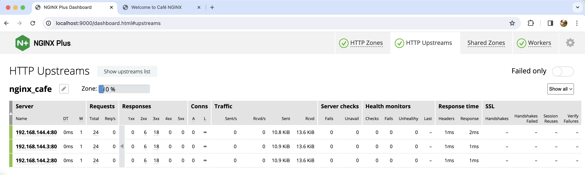
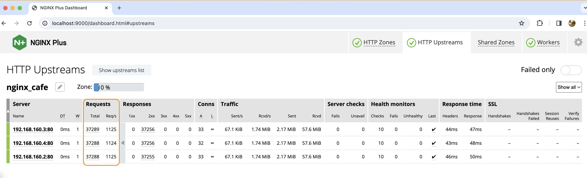
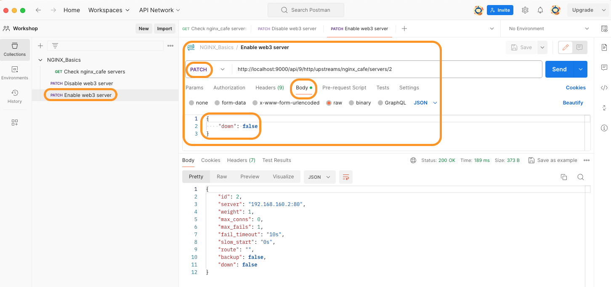

# Docker에서 NGINX Plus 빌드 및 실행

## 소개

NGINX Plus는 구독 라이센스(nginx-repo.crt 및 nginx-repo.key)가 필요한 엔터프라이즈 버전 입니다. 공개적으로 엑세스할 수 없으며 구독 라이센스를 통해 NGINX Plus 패키지 파일이 있는 리포지토리에 대한 엑세스를 제공 합니다. 이번 실습에서는 NGINX Plus 컨테이너를 이용해서 Plus만의 기능들 및 옵션을 확인합니다.

## 학습목표

이 랩의 실습을 마치면 다음을 수행할 수 있습니다:

- `NGINX Plus Docker`이미지를 빌드할 수 있음
- NGINX Plus 이미지로 랩 환경을 생성
- NGINX Plus 컨테이너 테스트
- NGINX OSS 구성을 NGINX Plus로 마이그레이션

NGINX Plus | Docker
:-------------------------:|:-------------------------:
  |

## NGINX Plus란?  

NGINX Plus `Commercial version of NGINX`로써 기본 NGINX OSS 빌드 위에 추가적인 엔터프라이즈 기능을 제공하는 솔루션 입니다. 아래는 NGINX Plus 기능만의 요약 목록 입니다.
- 가동중지 시간없이 동적 재구성 및 로딩을 제공
- 다운타임 없는 동작 NGINX 소프트웨어 업데이트
- 동적 DNS 확인 및 DNS 서비스 검색
- 240개 이상의 메트릭을 포함한 NGINX Plus API(통계 및 대시보드) 제공
- NGINX JavaScript Prometheus 익스포터 라이브러리
- 동적 업스크림
- 키 밸류 스토어
- 캐시 제거 API 제공
- 고가용성을 위한 NGINX 클러스터링
- 사용자 인증을 위한 OIDC를 사용한 JWT처리
- 웹 방화벽(App Protect)

## 사전준비사항

- NGINX plus 패키지에 대한 라이센스
- Docker가 설치되어 실행 중
- Docker-compose 설치
- (선택) NGINX API 호출을 위한 Postman API 도구
- (선택) NGINX 구성 파일 작업을 위한 Visual Studio Code 도구
- 이 워크샵을 위한 시스템 설정에 대한 지침은 `Lab0`를 참고하십시오

## Docker를 이용하여 NGINX Plus 빌드 및 실행

1. Visual Studio Code 또는 선호하는 IDE/텍스트 편집기로 workshop 폴더를 열어 제공된 파일을 읽고 편집할 수 있습니다.

1. 아래 3개의 NGINX Plus 라이센스 파일을 실습용 컴퓨터에 다운로드하거나 복사 합니다:

    - `nginx-repo.crt`, NGINX Plus repository 엑세스를 위한 TLS 인증서
    - `nginx-repo.key`, NGINX Plus repository 엑세스를 위한 TLS 키
    - nginx-repo.jwt, F5 컨테이너 registry에 접근을 위한 JWT 토큰

    트라이얼 라이센스는 아래의 링크를 통해서 받을 수 있습니다:

    [NGINX Plus Trial](https://www.nginx.com/free-trial-request/)

    >평가판 요청 양식을 제출하면 몇 분안에 3개의 라이센스 파일을 다운로드 할 수 있는 링크가 포함된 이메일을 받을 수 있습니다. 링크를 통해 파일은 한번만 다운로드 받을 수 있습니다.

1. 다운받은 구독 라이센스를 `lab5/nginx-plus/etc/ssl/nginx` 폴더에 복사 합니다.

1. `lab5/nginx-plus/etc/ssl/nginx`폴더에 nginx-repo.*와 같은 유형의 파일을 복사 합니다.

    ```bash
    cp /user/home/nginx-repo.* /user/workshop/lab5/nginx-plus/etc/ssl/nginx

    ```

1. /lab5 폴더에 있는 NGINX Plus 컨테이너 빌드를 위한 `docker-compose.yml` 파일의 내용을 확인 합니다.

   ```bash
    nginx-plus:              # NGINX Plus Web / Load Balancer
        hostname: nginx-plus
        container_name: nginx-plus
        build: nginx-plus    # Build new container, using /nginx-plus/Dockerfile
        volumes:
            - ./nginx-plus/etc/nginx/conf.d:/etc/nginx/conf.d        # Copy these folders to container
            - ./nginx-plus/etc/nginx/includes:/etc/nginx/includes
            - ./nginx-plus/etc/nginx/nginx.conf:/etc/nginx/nginx.conf
        ports:
            - 80:80       # Open for HTTP
            - 443:443     # Open for HTTPS
            - 9000:9000   # Open for status api
        restart: always 
   ```

1. 또한 `docker-compose.yml` 파일에는 아래와 같이 3개의 다른 Docker NGINX 웹 서버 컨테이너를 실행 합니다. 이들은 이번 실습의 업스크림 백엔드 웹 서버가 됩니다. 

    ```bash
    web1:
      hostname: web1
      container_name: web1
      image: nginxinc/ingress-demo   # Image from Docker Hub
      ports:
        - "80"                       # Open for HTTP
        - "443"                      # Open for HTTPS
    web2:
        hostname: web2
        container_name: web2
        image: nginxinc/ingress-demo
        ports:
            - "80"
            - "433"
    web3:
        hostname: web3
        container_name: web3
        image: nginxinc/ingress-demo
        ports:
            - "80"
            - "443"
    ```

1. 먼저 `lab5` 폴더에 있는지 확인 합니다. 터미널을 사용하여 Docker Compose를 빌드하고 실행 합니다.

   ```bash
    cd lab5
    docker compose up --force-recreate -d
   ```

1. 아래의 결과와 같이 모두 4개의 컨테이너가 동작하고 있는지 확인합니다:

    ```bash
    docker ps
    ```

    ```bash
    ###Sample output###
    CONTAINER ID   IMAGE                   COMMAND                  CREATED          STATUS          PORTS                                                                        NAMES
    717e1d8ff899   nginxinc/ingress-demo   "/docker-entrypoint.…"   13 seconds ago   Up 12 seconds   0.0.0.0:61344->80/tcp, 0.0.0.0:61343->443/tcp                                lab5-web3-1
    031354257db7   nginxinc/ingress-demo   "/docker-entrypoint.…"   13 seconds ago   Up 12 seconds   443/tcp, 0.0.0.0:61342->80/tcp, 0.0.0.0:61341->433/tcp                       lab5-web2-1
    a54a6e1fcda1   nginxinc/ingress-demo   "/docker-entrypoint.…"   13 seconds ago   Up 12 seconds   0.0.0.0:61346->80/tcp, 0.0.0.0:61345->443/tcp                                lab5-web1-1
    8dff0d9e7dce   lab5-nginx-plus         "nginx -g 'daemon of…"   13 seconds ago   Up 12 seconds   0.0.0.0:80->80/tcp, 0.0.0.0:443->443/tcp, 0.0.0.0:9000->9000/tcp, 8080/tcp   lab5-nginx-plus-1
    ```

1. 기본 웹 서버 컨테이너에 대한 NGINX Plus 부하분산을 테스트 합니다.

   **메모:** 아래의 명령을 3회 이상 수행 하세요. `web1`,`web2` 그리고 `web3`를 통해서 각각 응답이 서버에서 오는 것을 확인할 수 있습니다.

    ```bash
    curl -is http://localhost |  grep "Server Name"
    ```

    ```bash
    ###Sample output###
    # Output of 1st run
    <p class="smaller"><span>Server Name:</span> <span>web1</span></p>
    # Output of 2nd run
    <p class="smaller"><span>Server Name:</span> <span>web2</span></p>
    # Output of 3rd run
    <p class="smaller"><span>Server Name:</span> <span>web3</span></p>
    ```

1. 이번엔 브라우저를 통해서 NGINX Plus 컨테이너를 테스트 합니다.

    브라우저를 실행하고 <http://localhost> 경로를 입력 후 확인을 합니다.

    기본 Cafe 웹 페이지가 표시 되어야 합니다. 3~4번 새로고침을 하면 서버 이름이 변경되고 NGINX가 Round Robin 알고리즘을 사용하여 `web1`,`web2` 그리고 `web3` 3개의 NGINX Cafe 백엔드간에 로드밸런싱이 수행되는 것을 표시되며 서버의 주소도 각 백엔드 컨테이너와 일치함을 확인할 수 있습니다.

    

1. 이번 실습에 사용되는 백엔드 애플리케이션의 경우 아래와 같은 다른 URL도 포함하고 있습니다.
   - [http://cafe.example.com/coffee](http://cafe.example.com/coffee)
   - [http://cafe.example.com/tea](http://cafe.example.com/tea)
   - [http://cafe.example.com/icetea](http://cafe.example.com/icetea)
   - [http://cafe.example.com/beer](http://cafe.example.com/beer)
   - [http://cafe.example.com/wine](http://cafe.example.com/wine)
   - [http://cafe.example.com/cosmo](http://cafe.example.com/cosmo)
   - [http://cafe.example.com/mojito](http://cafe.example.com/mojito)
   - [http://cafe.example.com/daiquiri](http://cafe.example.com/daiquiri)
  
    이후 진행되는 랩에서 이러한 URL을 사용하게 되며, curl 또는 브라우저를 사용하여 올바르게 동작하는지 확인해야 합니다.
    /coffee | /tea
    :-------: | :-------:
     | 

1. Docker Exec 명령을 통해 NGINX Plus 컨테이너에 대한 엑세스를 확인합니다:

    ```bash
    docker exec -it nginx-plus /bin/bash
    ```

1. NGINX Plus 컨테이너 내에서 몇 가지 명령을 실행 할 수 있습니다:

    ```bash
    # nginx 설치 폴더의 파일 및 디렉토리 확인
    ls -l /etc/nginx

    ls -l /etc/nginx/conf.d
    ```

    ```bash
    # 설치된 nginx 패키지들에 대한 내용을 확인
    dpkg-query -l | grep nginx
    
    dpkg -s nginx-plus
    ```

    ```bash
    ##Sample Output
    ii  nginx-plus                 31-1~focal                   amd64        NGINX Plus, provided by Nginx, Inc.

    Package: nginx-plus
    Status: install ok installed
    Priority: optional
    Section: httpd
    Installed-Size: 7062
    Maintainer: NGINX Packaging <nginx-packaging@f5.com>
    Architecture: amd64
    Version: 31-1~focal
    Replaces: nginx, nginx-core, nginx-plus-debug
    Provides: httpd, nginx, nginx-plus-r31
    Depends: libc6 (>= 2.28), libcrypt1 (>= 1:4.1.0), libpcre2-8-0 (>= 10.22), libssl1.1 (>= 1.1.1), zlib1g (>= 1:1.1.4), lsb-base (>= 3.0-6)
    Recommends: logrotate
    Conflicts: nginx, nginx-common, nginx-core
    Conffiles:
     /etc/init.d/nginx 0b8cb35c30e187ff9bdfd5d9e7d79631
    /etc/init.d/nginx-debug ed610161bfa49f021f5afa483a10eac5
    /etc/logrotate.d/nginx a4da44b03e39926b999329061770362b
    /etc/nginx/conf.d/default.conf 5e054c6c3b2901f98e0d720276c3b20c
    /etc/nginx/fastcgi_params 4729c30112ca3071f4650479707993ad
    /etc/nginx/mime.types 754582375e90b09edaa6d3dbd657b3cf
    /etc/nginx/nginx.conf 563e30e020178f0db80bd2a87d6232a6
    /etc/nginx/scgi_params df8c71e25e0356ffc539742f08fddfff
    /etc/nginx/uwsgi_params 88ac833ee8ea60904a8b3063fde791de
    Description: NGINX Plus, provided by Nginx, Inc.
     NGINX Plus extends NGINX open source to create an enterprise-grade Application Delivery Controller, Accelerator and Web Server. Enhanced features include: Layer 4 and Layer 7 load balancing with health checks,session persistence and on-the-fly configuration; Improved content caching;Enhanced status and monitoring information; Streaming media delivery.
    Homepage: https://www.nginx.com/    
    ```

    ```bash
    # nginx 프로세스에 대한 동작 확인?
    ps aux |grep nginx
    ```

    ```bash
    ##Sample Output##
    root         1  0.0  0.0  10544  7040 ?        Ss   18:27   0:00 nginx: master process nginx -g daemon off;
    nginx        7  0.0  0.0  92924  4312 ?        S    18:27   0:00 nginx: worker process
    root        50  0.0  0.0   3312  1792 pts/0    S+   19:00   0:00 grep --color=auto nginx
    ```

    ```bash
    # 리눅스 리소스의 top 사용 프로세스 확인
    top -n 1
    ```

    ```bash
    ##Sample Output##
    top - 19:02:10 up 10 days, 20:41,  0 users,  load average: 0.00, 0.00, 0.00
    Tasks:   4 total,   1 running,   3 sleeping,   0 stopped,   0 zombie
    top - 19:02:26 up 10 days, 20:42,  0 users,  load average: 0.00, 0.00, 0.00
    Tasks:   4 total,   1 running,   3 sleeping,   0 stopped,   0 zombie
    %Cpu(s):  0.6 us,  0.6 sy,  0.0 ni, 98.9 id,  0.0 wa,  0.0 hi,  0.0 si,  0.0 st
    MiB Mem :   7846.6 total,   5467.4 free,    788.3 used,   1590.9 buff/cache
    MiB Swap:   1024.0 total,   1024.0 free,      0.0 used.   6785.1 avail Mem 

    PID USER      PR  NI    VIRT    RES    SHR S  %CPU  %MEM     TIME+ COMMAND                                                                
      1 root      20   0   10544   7040   6144 S   0.0   0.1   0:00.02 nginx                                                                  
      7 nginx     20   0   92924   4312   2944 S   0.0   0.1   0:00.51 nginx                                                                  
      9 root      20   0    4252   3328   2816 S   0.0   0.0   0:00.05 bash                                                                   
     53 root      20   0    5972   3200   2816 R   0.0   0.0   0:00.00 top 
    ```

    ```bash
    # nginx에 의해 사용되는 TCP Port 확인 ?
    netstat -alpn
    ```

    ```bash
    ##Sample output##
    Active Internet connections (servers and established)
    Proto Recv-Q Send-Q Local Address           Foreign Address         State       PID/Program name    
    tcp        0      0 127.0.0.11:41055        0.0.0.0:*               LISTEN      -                   
    tcp        0      0 0.0.0.0:80              0.0.0.0:*               LISTEN      1/nginx: master pro 
    tcp        0      0 192.168.32.5:57614      185.125.190.36:80       TIME_WAIT   -                   
    udp        0      0 127.0.0.11:38617        0.0.0.0:*                           -                   
    Active UNIX domain sockets (servers and established)
    Proto RefCnt Flags       Type       State         I-Node   PID/Program name     Path
    unix  3      [ ]         STREAM     CONNECTED     1446456  1/nginx: master pro  
    unix  3      [ ]         STREAM     CONNECTED     1446455  1/nginx: master pro  
    ```

    ```bash
    # nginx help 페이지 확인
    nginx -h
    ```

    ```bash
    ##Sample Output##
    nginx version: nginx/1.25.3 (nginx-plus-r31)
    Usage: nginx [-?hvVtTq] [-s signal] [-p prefix]
             [-e filename] [-c filename] [-g directives]

    Options:
      -?,-h         : this help
      -v            : show version and exit
      -V            : show version and configure options then exit
      -t            : test configuration and exit
      -T            : test configuration, dump it and exit
      -q            : suppress non-error messages during configuration testing
      -s signal     : send signal to a master process: stop, quit, reopen, reload
      -p prefix     : set prefix path (default: /etc/nginx/)
      -e filename   : set error log file (default: /var/log/nginx/error.log)
      -c filename   : set configuration file (default: /etc/nginx/nginx.conf)
      -g directives : set global directives out of configuration file
    ```

    ```bash
    # NGINX 버전 확인:
    nginx -V
    ```

    ```bash
    ##Sample Output##
    nginx version: nginx/1.25.3 (nginx-plus-r31)
    built by gcc 9.4.0 (Ubuntu 9.4.0-1ubuntu1~20.04.2) 
    built with OpenSSL 1.1.1f  31 Mar 2020
    TLS SNI support enabled
    configure arguments: --prefix=/etc/nginx --sbin-path=/usr/sbin/nginx --modules-path=/usr/lib/nginx/modules --conf-path=/etc/nginx/nginx.conf --error-log-path=/var/log/nginx/error.log --http-log-path=/var/log/nginx/access.log --pid-path=/var/run/nginx.pid --lock-path=/var/run/nginx.lock --http-client-body-temp-path=/var/cache/nginx/client_temp --http-proxy-temp-path=/var/cache/nginx/proxy_temp --http-fastcgi-temp-path=/var/cache/nginx/fastcgi_temp --http-uwsgi-temp-path=/var/cache/nginx/uwsgi_temp --http-scgi-temp-path=/var/cache/nginx/scgi_temp --user=nginx --group=nginx --with-compat --with-file-aio --with-threads --with-http_addition_module --with-http_auth_request_module --with-http_dav_module --with-http_flv_module --with-http_gunzip_module --with-http_gzip_static_module --with-http_mp4_module --with-http_random_index_module --with-http_realip_module --with-http_secure_link_module --with-http_slice_module --with-http_ssl_module --with-http_stub_status_module --with-http_sub_module --with-http_v2_module --with-http_v3_module --with-mail --with-mail_ssl_module --with-stream --with-stream_realip_module --with-stream_ssl_module --with-stream_ssl_preread_module --build=nginx-plus-r31 --mgmt-id-path=/var/lib/nginx/nginx.id --with-http_auth_jwt_module --with-http_f4f_module --with-http_hls_module --with-http_proxy_protocol_vendor_module --with-http_session_log_module --with-mgmt --with-stream_mqtt_filter_module --with-stream_mqtt_preread_module --with-stream_proxy_protocol_vendor_module --with-cc-opt='-g -O2 -fdebug-prefix-map=/data/builder/debuild/nginx-plus-1.25.3/debian/debuild-base/nginx-plus-1.25.3=. -fstack-protector-strong -Wformat -Werror=format-security -Wp,-D_FORTIFY_SOURCE=2 -fPIC' --with-ld-opt='-Wl,-Bsymbolic-functions -Wl,-z,relro -Wl,-z,now -Wl,--as-needed -pie'
    ```

    ```bash
    # NGINX 설정 검증
    nginx -t
    ```

    ```bash
    ##Sample Output##
    nginx: the configuration file /etc/nginx/nginx.conf syntax is ok
    nginx: configuration file /etc/nginx/nginx.conf test is successful
    ```

    ```bash
    # NGINX 설정 파일의 출력
    ```

    ```bash
    # 특정 access logs의 확인
    tail -f /var/log/nginx/cafe.example.com.log
    ```

    ```bash
    # 특정 error logs의 확인
    tail -f /var/log/nginx/cafe.example.com_error.log
    ```

    NGINX Plus 컨테이너에 대한 둘러보기를 마쳤으면 exit를 입력하여 컨테이너에서 빠져 나올 수 있습니다.

    ```bash
    exit
    ```

## NGINX Plus Dashboard


이번 섹션에서는 NGINX Plus 상태 대시보드를 활성화하고 NGINX에서 프록시로 다양한 테스트를 수행하는 동안 상태 변경 및 메트릭을 모니터링 합니다.

The NGINX Plus Dashboard and statistics API provide over 240 metrics about the request and responses flowing through NGINX Plus proxy. This is a great feature to allow you to watch and triage any potential issues with NGINX Plus as well as any issues with your backend applications. Some of metrics provided include the following:
NGINX Plus 대시보드는 및 통계 API는 NGINX Plus 프록시를 통해 처리되는 요청 및 응답에 대한 240개 이상의 메트릭을 제공합니다. 이것은 NGINX Plus의 잠재적인 문제와 백엔드 애플리케이션의 문제를 실시간으로 확인할 수 있는 훌륭한 기능 입니다. 제공되는 메트릭 중 일부는 아래와 같습니다.

- TCP throughput and connections
- HTTP request and response stats and all status codes
- Virtual Server and Location context metrics
- Upstream context metrics
- Healthcheck success/failures
- SSL handshakes, sessions and reuse
- NGINX caching metrics
- DNS resolver
- NGINX clustering
- NGINX Worker Metrics
- Ratelimit Metrics

이러한 모든 메트릭 항목은 NGINX Plus API를 통해 JSON 객체로 사용할 수 있으므로 통계 및 특정 항목에 대해서 외부 모니터링 도구로 쉽게 가져올 수 있습니다.

1. `dashboard.conf`파일의 내용을 확인하고 `server` 블록에 설정된 NGINX Plus 대시보드의 설정 부분을 확인 합니다.
    - 대시보드는 9000번 포트로 리스닝
    - 접속 URL은 [http://localhost:9000/dashboard.html](http://localhost:9000/dashboard.html)
  
    ```nginx
    server {
        # Conventional port for the NGINX Plus API is 9000
        listen 9000;
        access_log off; # reduce noise in access logs

        location /api/ {
        # Enable in read-write mode
        api write=on;
        }
        # Conventional location of the NGINX Plus dashboard
        location = /dashboard.html {
            root /usr/share/nginx/html;
        }

        # Redirect requests for "/" to "/dashboard.html"
        location / {
            return 301 /dashboard.html;
        }
    }
    ```

1. `cafe.example.com.conf`파일을 열어서 9번째 라인(Server 블록)), 22번쨰 라인의(Location 블록) `status_zone` 지시자의 설정 부분의 주석을 제거 합니다.

    ```nginx
    # cafe.example.com HTTP
    server {
        # Listening on port 80 on all IP addresses on this machine
        listen 80 default_server;

        server_name cafe.example.com "";

        # Uncomment to capture metrics for this server block
        status_zone cafe.example.com_http;

        ...

        location / {
            
            # Including best-practice headers are bonus points
            # include includes/proxy_headers.conf;
            # include includes/keepalive.conf;
            
            # Uncomment to capture metrics for this location block
            status_zone /;

            proxy_pass http://nginx_cafe;
        }

        ...
    }
    ```

1. `upstreams.conf`파일 20번쨰 라인의 `zone` 지시문의 주석처리를 제거하여 업스트림 블록에서 메트릭 값을 캡쳐 합니다.

    ```nginx
    # nginx-cafe servers 
    upstream nginx_cafe {

        # Load Balancing Algorithms supported by NGINX
        # - Round Robin (Default if nothing specified)
        # - Least Connections
        # - IP Hash
        # - Hash (Any generic Hash)     
        # - Least Time (NGINX Plus only)
        
        # Uncomment to enable least_time load balancing algorithm
        # least_time header; # Other Options: header|last_byte|last_byte inflight

        # Uncomment to capture metrics for upstream block
        zone nginx_cafe 64k;
        
        ...
    }
    ```

1. 위 2개의 구성 파일을 편집한 후 NGINX 구성을 다시 로드 합니다:

   ```bash
   nginx -t
   nginx -s reload
   ```

1. 브라우저를 열고 아래의 URL을 입력하여 대시보드를 엽니다: [http://localhost:9000/dashboard.html](http://localhost:9000/dashboard.html).

   아래 화면과 같은 화면이 보일 것 입니다.
   

   NGINX Plus 대시보드의 HTTP 영역 탭에서 가상 서버에 연결하는 모든 클라이언트의 집계된 통계를 볼 수 있습니다. 서버 영역 아래에는 Location 블록에 대한 통계를 확인할 수 있습니다.

   
   HTTP 업스트림 탭에서 각 백엔드 서버에 대한 고유한 통계를 볼 수 있으며, 다음과 같은 세부 메트릭을 제공 합니다.
    - 초당 HTTP요청 수 및 누적 총 HTTP 요청
    - 모든 HTTP 응답코드
    - 활성 TCP 연결
    - 초당 받은 Bytes 수 및 총 누적 합산 Bytes 수
    - Health 체크의 성공 및 실패
    - HTTP 해더 및 전체 응답시간
    - SSL 핸드쉐이크 성공 및 실패, 세션수
  
    이러한 업스트림 메트릭은 백엔드 서버를 모니터링하여 문제를 해결하는데 매우 유용 합니다.

    

    Workers 탭에서는 각 Worker 프로세스에 대한 프로세스 ID, 활성연결, 유휴연결, 총 요청, 초당 요청 등과 같은 통계를 볼 수 있습니다.

    이러한 측정항목을 보려면 브라우저에서 새탭을 열어 <http://cafe.example.com/coffee> 페이지로 이동하여 하단 중앙의 "새로고침" 체크 박스를 선택하면 자동으로 새로고침을 하기 때문에 쉽게 확인할 수 있습니다.

    NGINX Plus 대시보드로 돌아가서 메트릭이 변경되는 것을 관찰 합니다.

## Active HealthChecks

이번 랩에서는 Active Health Check 기능을 활성화하고 테스트 합니다. Active Health Check 기능은 기본적으로 백엔드 애플리케이션을 주기적으로 확인하여 정상 상태인지를 빠르고 능동적으로 확인 합니다. 그리고 백엔드 애플리케이션의 요구사항과 일치하도록 완전하게 사용자 지정방식으로 설정을 할 수 있습니다. 

1. `cafe.example.com.conf`파일의 내용을 확인 후 아래 55-56 라인의 부분을 확인 및 코멘트를 제거하여 Active Health Check를 활성화 합니다.

   ```nginx
    # cafe.example.com HTTP
    server {
        ...

        # Active Health Check 활성화
        location @health_check {
                internal;            # Requests by NGINX only
                proxy_set_header Host cafe.example.com;
                proxy_pass http://nginx_cafe;
                health_check interval=5s fails=3 passes=2 uri=/ match=status_ok;    

                # Health Check의 성공 로그는 큰 의미가 없기 때문에 로깅에서 제외하고 에러에 대해서는 모니터링이 필요하기 때문에 로깅을 설정 함
                access_log off;
                error_log  /var/log/nginx/error.log error;
        }
    }
   ```

   위 설정에서 health_check 지시문의 내용은 아래와 같습니다

   - interval=5s : 매 5초마다 확인
   - fails=3 :  3번의 실패 후 서버를 다운으로 표시
   - passes=2 : 2번의 성공 시 서버를 업으로 표시
   - uri=/ : 확인할 URI (/)
   - match=status_ok : 사용자 지정 응답 검사를 사용할 때 응답의 내용과 일치하는 조건인가를 확인하는 설정(세부 설정은 아래 `status_ok.conf` 파일을 참고)

        ```nginx
        # Simple health check expecting http 200 and correct Content-Type
        match status_ok {
            status 200;
            header Content-Type = "text/html; charset=utf-8"; # For the nginx-cafe html
        }
        ```

1. 설정 파일을 편집 후 NGINX를 다시 로드 합니다.

   ```bash
   nginx -t
   nginx -s reload
   ```

1. [http://localhost:9000/dashboard.html](http://localhost:9000/dashboard.html) 대시보드에서 설정된 업스트림 서버에 대한 Health Monitor 결과를 확인할 수 있습니다.
     

1. 로컬 시스템에서 터미널을 사용하여 web3 컨테이너를 중지하여 상태 확인 실패를 트리거 후 결과를 확인 합니다.

   ```bash
   docker ps
   docker stop web3 
   ```

1. 해당 컨테이너를 stop 후 다시 브라우저의 대시보드 화면에서 해당 백엔드 서버의 상태 정보를 확인 합니다.
   

    위 화면에서 `DT` 컬럼은 특정 백앤드 서버의 다운타임을 의미 합니다. (위 화면에서는 web3 서버는 다운타임이 8분이라는 의미) 그리고 `Health monitors` 섹션 `Last` 컬럼의 `x`는 마지막 health check 실패 후 NGINX가 더 이상 해당 서버로 트래픽을 보내지 않는다는 의미 입니다.

1. 그리고 위 Active Health Monitor 설정에서 에러 시에는 `/var/log/nginx/error.log` 파일에 로깅 설정을 했기 때문에 해당 파일을 열어서 어떤 로그가 있는가를 확인 합니다.

   ```bash
   docker exec -it nginx-plus more /var/log/nginx/error.log
   ```

   ```bash
   ##Sample Output##
   2024/02/13 17:16:07 [error] 70#70: upstream timed out (110: Connection timed out) while connecting to upstream, health check "status_ok" of peer 192.168.96.4:80 in upstream "nginx_cafe"

    2024/02/13 17:16:15 [error] 70#70: connect() failed (113: No route to host) while connecting to upstream, health check "status_ok" of peer 192.168.96.4:80 in upstream "nginx_cafe"
   ```

   2가지 타입의 오류가 있습니다. 하나는 TCP 연결에 대한 문제이고, 다른 하나는 HTTP health check에 대한 문제를 기록하고 있습니다.

1. 백엔드 서버 문제를 확인하고 분석이 완료되었다면 다시 `web3` 백엔드 서버를 아래 명령으로 살려보겠습니다.

   ```bash
    docker start $WEB3
   ```

   시작 후 2번의 성공 메세지를 받으면 NGINX는 `web3` 백엔드 서버가 다시 정상임을 감지하고 트래픽을 전달하기 시작 합니다. 다시 NGINX Plus의 대시보드를 확인하면 해당 백엔드 서버는 "그린" 색으로 변경되고 정상적으로 트래픽이 유입되는 것을 확인할 수 있습니다.
   

## NGINX Dynamic Reconfiguration

이번 랩에서는 트래픽에 영향을 주지 않고 NGINX Plus를 재설정 할 수 있는 방법에 대해서 알아보겠습니다. 트래픽이 많은 실제 라이브 환경을 시뮬레이션하기 위해 HTTP 부하 생성도구(WRK)를 실행 합니다. NGINX Plus 실시간 대시보드를 관찰하는 동안 몇 가지 변경 사항을 적용하고 NGINX를 다시 로드 합니다.

1. 브라우저에서 NGINX 대시보드를 열어둔 상태로 진행을 하도록 하겠습니다. 이번 섹션에서는 이 대시보드를 자주 보게 될 것 입니다.

1. 아래 도커 명령으로 `wrk`부하 생성기를 다운로드 및 실행 합니다.(실행 시 환경이 지정되어 있어 대상, 시간 등의 지정된 사이트로 트래픽을 발생시킴)

   ```bash
    docker run --network=lab5_default --rm williamyeh/wrk -t4 -c200 -d5m -H 'Host: cafe.example.com' --timeout 2s http://nginx-plus/coffee
   ```

    위 설정은 wrk 부하 생성기는 `/coffee`패스를 대상으로 5분간 200개의 Actice Connection을 생성합니다.

1. `upstreams.conf`파일을 열어서 `least_time last_byte` 로드밸런싱 알고리즘 설정에 대한 주석을 제거하여 적용 합니다. 이 로드밸런싱 알고리즘은 각 백엔드 애플리케이션의 응답 시간을 모니터링한 다음 가장 빠른 백엔드 서버로 새로운 요청을 전달하는 방식 입니다. 이는 다른 성능의 하드웨어 유형을 사용하는 경우와 같이 백엔드의 응답 시간에 큰 차이가 있을 때 널리 사용되는 기능 입니다.

   ```nginx
    # nginx-cafe servers 
    upstream nginx_cafe {

        # Load Balancing Algorithms supported by NGINX
        # - Round Robin (Default if nothing specified)
        # - Least Connections
        # - IP Hash
        # - Hash (Any generic Hash)     
        # - Least Time (NGINX Plus only)
        
        # Uncomment to enable least_time load balancing algorithm
        least_time last_byte; # Other Options: header|last_byte|last_byte inflight

        ...
    }
   ```

1. 설정 파일을 편집 후 NGINX의 설정을 검사 합니다.

   ```bash
   nginx -t
   ```

1. NGINX 대시보드를 확인하면서 NGINX를 다시 로드(reload) 합니다.

   ```bash
   nginx -s reload
   ```

   무엇을 관찰하셨나요?
   - 통계 정보가 "0"로 초기화된 부분이 있나요? 없을 겁니다. NGINX Plus는 트래픽에 영향을 주지 않습니다. 

        (**메모:** 이 랩 환경에서는 모든 컨테이너가 동일한 리소스와 네트워크를 가지고 있기 때문에 응답 속도가 더 빠른 서버로의 분산의 확인은 어려울 수 있습니다.)

    Lab2에서 NGINX reload를 수행할 때 발생하는 상황에 대한 자세한 설명이 있습니다. 요약하면, NGINX Plus를 사용하면 새 worker 프로세스가 생성되고 모든 새 연결 및 요청에 대해 새 설정을 즉시 사용하기 시작 합니다. 이전에 작업 중인 상태가 있다면 이전 작업을 완료한 다음 해당 TCP 연결을 닫을 수 있으며, 트래픽에 대한 영향은 없습니다. 마스터 프로세스는 이전 worker 프로세스가 작업을 완료하고 모든 연결을 닫은 후 이전 worker 프로세스를 종료하기 때문 입니다. 

## NGINX 업스트림 관리

이번 랩에서는 NGINX Plus API를 사용하여 백엔드 서버를 동적으로 관리 합니다. 현재 랩 환경에서 `Web3` 서버가 예약된 관리 작업을 위해 잠시 제거를 해야 하지만 현재 트래픽을 처리하고 있는 상태 입니다. 이 섹션에서 해당 서버의 트래픽에 영향을 주지 않으면서 로드밸런싱에서 제거하는 작업을 수행 합니다. 유지보수가 완료되면 해당 서버를 다시 투입하여 트래픽을 처리할 수 있도록 합니다. 

1. NGINX 대시보드를 브라우저에 띄운 상태로 랩을 진행 합니다.

1. 이전과 동일하게 `wrk` 부하 발생기를 통해 트래픽을 생성 합니다. 

   ```bash
    docker run --network=lab5_default --rm williamyeh/wrk -t4 -c200 -d20m -H 'Host: cafe.example.com' --timeout 2s http://nginx-plus/coffee
   ```

    위 설정은 `/coffee`패스에 대해 20분 동안 200개의 Active Connection을 유지 합니다.

1. NGINX 대시보드의 `HTTP Upstreams` 탭을 보면 3개의 백엔드 서버가 모두 트래픽을 처리하고 있음을 확인할 수 있습니다. 
   

1. 이제 `Postman` 도구를 실행하고 `NGINX_Basics` Collection을 확인 합니다.

   (**메모:** 만약 postman 툴이 익숙하지 않는다면 터미널에서 curl 명령으로도 동일한 작업을 수행할 수 있습니다.)

1. `Check nginx_cafe servers` collection을 선택 후 `Send`버튼을 요청을 전송하고 결과를 확인 합니다. 결과는 nginx_cafe에 3개의 백엔드 서버가 있음확인할 수 있고 또한 `web3` 서버는 `id=2`라는 값을 가지고 있는 것을 확인할 수 있습니다. 위는 이 `id`를 다음 API 작업에서 이용 합니다. 

    

    ```bash
     #[선택] curl 명령을 사용하는 경우 아래와 같이 터미널에서 실행 합니다.
     curl 'http://localhost:9000/api/9/http/upstreams/nginx_cafe' | jq
    ```

1. 이제 우리는 NGINX Master 프로세스가 더 이상 트래픽을 전송하지 않도록 `web3` 서버를 `down` 상태로 만듭니다. 포스트맨 툴에서 `Disable web3 server` Collection을 선택하고 `Send` 버튼을 클릭하여 요청을 전송 합니다. 

    

    ```bash
     #[선택] curl 명령을 사용할 경우 아래 내용을 터미널에서 실행 합니다.
     curl --request PATCH 'http://localhost:9000/api/9/http/upstreams/nginx_cafe/servers/2' \
    --header 'Content-Type: application/json' \
    --data '{
        "down": true
    }' | jq
    ```

1. NGINX 대시보드에서 확인하면, `web3` 서버가 `grey` 색으로 변경되고 상태정보도 `down`으로 표시가 됩니다. 그리고 해당 서버로는 더 이상 트래픽을 전달하지 않는 것도 확인할 수 있습니다.

   
  
1. 이 후 `web3` 서버의 패치 및 관리작업이 모두 종료가 되면, `web3` 서버의 상태정보를 `down=false`로 변경하여 다시 로드밸런싱 대상으로 투입되어 트래픽을 처리하는 상태로 만듭니다. 포스트맨 툴에서 `Enable web3 server` Collection을 선택하고 `Send` 버튼을 클릭 합니다. 
   

   ```bash
     #[선택] curl 명령을 사용할 경우 아래 내용을 터미널에서 실행 합니다. 
     curl --request PATCH 'http://localhost:9000/api/9/http/upstreams/nginx_cafe/servers/2' \
    --header 'Content-Type: application/json' \
    --data '{
        "down": false
    }' | jq
    ```

1. 그리고 다시 NGINX 대시보드를 통해 확인하면, `web3`서버의 상태가 `green`로 변경되며 상태정보가 `up`되고  다시 트래픽을 처리하는 것을 확인할 수 있습니다.

   

## NGINX Live Activity Monitoring JSON feed

이번 랩에서는 NGINX Plus API를 사용하여 현재 통계를 JSON 포맷으로 가져 옵니다. `/api/[api-version]/`에서 전체 통계를 요청할 수 있으며, `[api-version]`은 NGINX Plus API의 버전 번호를 의미 합니다. 이 API는 모든 NGINX Plus 메트릭(240개 이상의 메트릭)을 포함하고 있어 원하는 중앙 모니터링 도구로 가져올 수 있으므로 매우 유용 합니다.

1. `Postman` 툴을 열어서 `NGINX_Basics` collection을 선택 합니다.

   (**메모:** `lab5` 폴더에 `postman collection.json` 파일을 이용해서 로컬의 자체 환경에서도 활용을 할 수 있습니다. 만약 postman 툴이 익숙하지 않는다면 curl 명령으로 터미널에서도 동일하게 실행할 수 있습니다.

2. `NGINX Info` 요청을 선택하고 `Send`버튼을 클릭 합나다. `/api/[api-version]/nginx` 요청은 NGINX의 기본정보, 버전, 업타임 그리고 식별 정보를 검색하는데 사용 됩니다.

    

    ```bash
     #[Optional] curl command if not using postman
     curl 'http://localhost:9000/api/9/nginx' | jq
    ```

3. `NGINX Connections` 요청을 선택하고 `Send` 버튼을 클릭 합니다. `/api/[api-version]/connections` 요청은 NGINX의 유휴 컨텍션 및 토탈 컨넥션 정보를 검색하는데 사용 됩니다. 

    

    ```bash
     #[Optional] curl command if not using postman
     curl 'http://localhost:9000/api/9/connections' | jq
    ```

4. `NGINX Server Zones`요청을 선택하고 `Send`버튼을 클릭 합니다. `/api/[api-version]/http/server_zones` 요청은 각 HTTP 서버 그룹에 대한 요청 및 응답 수를 검색하는데 사용 됩니다. 

    

    ```bash
     #[Optional] curl command if not using postman
     curl 'http://localhost:9000/api/9/http/server_zones' | jq
    ```

5. `NGINX Location Zones` 요청을 선택하고 `Send`버튼을 클릭 합니다. `/api/[api-version]/http/location_zones` 요청은 각 HTTP Location 그룹에 대한 요청 및 응답 수를 검색하는데 사용 됩니다. 

    

    ```bash
     #[Optional] curl command if not using postman
     curl 'http://localhost:9000/api/9/http/location_zones' | jq
    ```

6. `NGINX Upstreams` 요청을 선택하고 `Send` 버튼을 클릭 합니다. `/api/[api-version]/http/upstreams` 요청은 업스트림 그룹의 서버당 요청 및 응답 수, 응답시간, 상태 및 가동 시간 통계를 검색하는데 사용 됩니다.

    

    ```bash
     #[Optional] curl command if not using postman
     curl 'http://localhost:9000/api/9/http/upstreams' | jq
    ```

> 만약 `wrk` 부하 발생 툴이 계속 동작 중이라면 `ctrl + c`를 눌러 중지 할 수 있습니다.

> `lab5` 실습을 모두 완료하셨다면 아래 docker-compose 명령으로 테스트 환경을 종료할 수 있습니다.

```bash
cd lab5
docker compose down
```

```bash
##Sample output##
Running 5/5
Container nginx-plus         Removed
Container web2               Removed
Container web3               Removed
Container web1               Removed                            
Network lab5_default         Removed

```

**이것으로 Lab5를 완료 합니다!! 축하 드립니다^^**

## 참고링크

- [NGINX Plus](https://docs.nginx.com/nginx/)
- [NGINX Admin Guide](https://docs.nginx.com/nginx/admin-guide/)
- [NGINX Technical Specs](https://docs.nginx.com/nginx/technical-specs/)
- [NGINX Plus API Module](https://nginx.org/en/docs/http/ngx_http_api_module.html)
- [NGINX Plus Dynamic Upstreams]( https://docs.nginx.com/nginx/admin-guide/load-balancer/dynamic-configuration-api/)

### Authors

- Chris Akker - Solutions Architect - Community and Alliances @ F5, Inc.
- Shouvik Dutta - Solutions Architect - Community and Alliances @ F5, Inc.

-------------

Navigate to ([Lab6](../lab6/readme.md) | [Main Menu](../readme.md))
