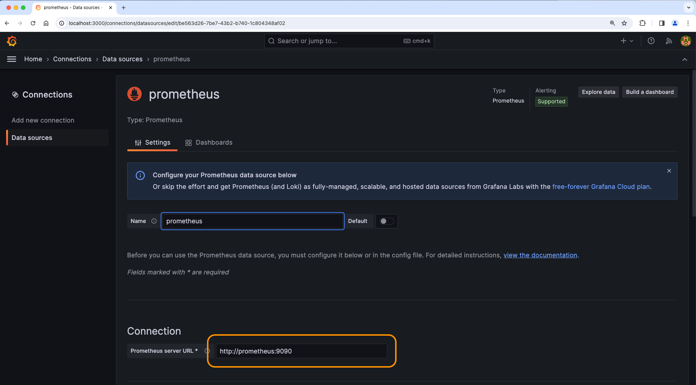

# Prometheus와 Grafana를 이용한 NGINX+ 모니터링

## 소개

이번 랩에서는 최근 많이 사용하는 오픈소스 모니터링 솔루션인 Prometheus 및 Grafa를 활용해서 NGINX+(NGINX OSS도 해당) 모니터링을 실습 합니다.  


이 솔루션을 사용하려면 NGINX+에서 제공하는 Javascript 및 Prometheus 모듈을 사용하여 NGINX+ API를 통해 메트릭 정보를 수집하고 해당 메트릭을 게시용 통계를 스크랩하기 때문에 일반적으로 `scaper page`(스케이퍼 페이지)로 명시되는 HTTP html/text 페이지로 내보내야 합니다.


그런 다음 이 내보내기 페이지의 메트릭을 읽고 Prometheus 및 Grafana의 시계열 데이터베이스로 가져옵니다. 이러한 지표가 데이터베이스에 있으면 시각화 및 보고를 위한 다양한 대시보드, 임계값, 경고 및 기타 유형의 그래프를 생성할 수 있습니다.


이미 잘 알고 있겠지만 NGINX에는 사용자가 생성하고 무료로 사용해 볼 수 있는 수백 개의 Grafana 대시보드가 있습니다. Grafana를 사용하면 자신만의 대시보드를 만들고 편집할 수 있습니다.

NGINX+ | Prometheus | Grafana
:-------------------------:|:-------------------------:|:-----:
  | |
  
## 학습목표

실습을 마치면 다음을 수행할 수 있습니다.

- NGINX Java Script 활성화 및 설정
- Prometheus 내보내기 설정
- Prometheus 서버 사용
- Grafana 서버 사용
- Grafana 대시보드의 보기 및 활용

## 사전 요구사항

- 서버(랩용)에 Docker가 설치되고 실행 중이어 합니다.
- Docker-compose가 설치되어 있어야 합니다.
- NGINX+ 라이선스 또는 평가판/구독이 필요 합니다.
- 이 워크샵을 위한 시스템 설정 지침은 `Lab0`을 참조하세요. 
- 기본 Linux 명령 및 명령줄 도구에 대한 이해가 필요합니다.
- Docker의 기본 개념과 명령어에 대한 이해가 필요합니다.
- 기본적인 HTTP 프로토콜에 대한 이해가 필요합니다.
- Prometheus에 대한 기본 지식이 필요합니다.
- Grafana에 대한 기본 지식이 필요합니다.

As part of your Dockerfile, your NGINX Plus container already has the added `NGINX Java Script and NGINX Prometheus dynamic module` installed during the build process.  Refer to the Dockerfile if you want to check it out.

Dockerfile의 일부로 NGINX+ 컨테이너에는 빌드 프로세스 중 NGINX Java Script 및 NGINX Prometheus 동적 모듈이 이미 추가되어 있기 때문에 확인이 필요하시면 Dockerfile의 내용을 참조하세요.

1. `lab6`폴더에서 시작을 할 수 있기 때문에 현재 디렉토리가 `lab6`에 있는지 확인하세요. 터미널을 사용하여 Docker Compose를 실행하여 모든 컨테이너를 빌드하고 실행 합니다. 

    ```bash
     cd lab6
     docker compose up --force-recreate -d
    ```

1. `nginx.conf`파일에서 아래와 같이 2개의 주석으로 처리된 내용을 주석제거를 통해 활성화 합니다.

    - `ngx_http_js_module` 활성화를 위해 라인 #8의 주석을 제거 합니다.
    - #37라인의 주석을 제거하여 `subrequest_output_buffer_size` 라는 내용의 NGINX 버퍼 파라메터를 활성화 합니다.

    ```nginx
    ...snip

    user  nginx;
    worker_processes  auto;

    error_log  /var/log/nginx/error.log info;
    pid        /var/run/nginx.pid;

    # Uncomment to enable NGINX JavaScript module
    load_module modules/ngx_http_js_module.so;   # Added for Prometheus

    ...snip

        # Uncomment for Prometheus scraper page output
        subrequest_output_buffer_size 32k;       # Added for Prometheus

    ...snip

    ```

1. `labs/lab6/nginx-plus/etc/nginx/conf.d/` 폴더에서 `prometheus.conf` 파일을 확인 합니다. 설정을 보면 NGINX는 9113 포트를 열고 스크래퍼 페이지에 대한 엑세스를 제공하는 설정입니다. 활성화하기 위해 모든 행의 주석처리를 제거 하세요.

    ```nginx
    # NGINX Plus Prometheus configuration, for HTTP scraper page
    # Chris Akker, Shouvik Dutta - Feb 2024
    # https://www.nginx.com/blog/how-to-visualize-nginx-plus-with-prometheus-and-grafana/
    # Nginx Basics
    #
    # Uncomment all lines below
    js_import /usr/share/nginx-plus-module-prometheus/prometheus.js;

    server {
    
        listen 9113;               # This is the default port for Prometheus scraper page
        
        location = /metrics {
            js_content prometheus.metrics;
        }

        location /api {
            api;
        } 

    }

    ```

1. 두 파일의 내용을 모두 업데이트 후 저장하면 Docker Exec를 통해 NGINX+ 컨테이너에 접속을 합니다.

    ```bash
     docker exec -it nginx-plus bin/bash
    ```

1. 접속한 NGINX+ 컨테이너 내에서 `nginx -t` 명령과 `nginx -s reload` 명령을 수행하여 NGINX의 설정을 검사하고 업데이트 합니다.

1. Docker로 실행되는 WRK라는 부하생성툴을 시작합니다. 이 툴을 통해 NGINX+로 트래픽을 발생하고 통계 정보의 업데이트가 발생할 것 입니다.

    ```bash
    docker run --name wrk --network=lab6_default --rm williamyeh/wrk -t4 -c200 -d20m -H 'Host: cafe.example.com' --timeout 2s http://nginx-plus/coffee
    ```

1. 브라우저를 열고 <http://localhost:9113/metrics> 주소를 입력하여 NGINX의 prometheus 스크래퍼 페이지를 확인합니다. 아래와 같이 html/text 페이지가 보일 것 입니다. 사용 가능한 통계가 많이 있다는 것을 확인할 수 있으며, 이 페이지는 NGINX+ 대시보드의 텍스트 버전과 동일합니다. 이 페이지는 기존 성능 관리 및 모니터링 도구로 쉽게 가져올 수 있습니다. prometheus 및 grafana를 사용하여 다음 섹션에서 이 작업을 수행하는 방법을 살펴보겠습니다.

    몇번 새로고침 버튼을 클릭하면 메트릭 정보가 업데이트(증가)되는 것을 확인할 수 있습니다.

    

<br/>

## Prometheus 및 Grafana 서버 Docker 컨테이너

<br/>

  |
--- | ---

1. `docker-compose.yml` 파일을 살펴보면 이 실습을 위한 2개의 추가 Docker 컨테이너가 포함되어 있는 것을 확인할 수 있습니다. 하나는 prometheus 서버용이고 다른 하나는 grafana 서버용 입니다. 이는 자동으로 실행되도록 구성되어 있지만 이미지 는 공개 저장소에서 가져 옵니다(인터넷 연결이 필요, 로컬 리포지토리가 있다면 로컬 리포지토리에 이미지 업로드 후 인터넷의 연결없이 사용할 수도 있습니다).

    ```bash
    ...snip
    
    prometheus:
        hostname: prometheus
        container_name: prometheus
        image: prom/prometheus
        volumes:
            - ./nginx-plus/etc/prometheus/prometheus.yml:/etc/prometheus/prometheus.yml
        ports:
            - "9090:9090"
        restart: always
        depends_on:
            - nginx-plus
    grafana:
        hostname: grafana
        container_name: grafana
        volumes:
            - grafana-storage:/var/lib/grafana
        image: grafana/grafana
        ports:
            - "3000:3000"
        restart: always
        depends_on:
            - nginx-plus
    volumes:
    grafana-storage:
        name: "grafana-storage"
        external: false

    ```

1. 실행 후 2개의 컨테이너가 동작 중인지 확인하세요.

    ```bash
    docker ps -a
    ```

    ```bash
    ##Sample output##
    CONTAINER ID   IMAGE                   COMMAND                  CREATED          STATUS          PORTS                                                                                      NAMES
    8a61c66fc511   prom/prometheus         "/bin/prometheus --c…"   36 minutes ago   Up 36 minutes   0.0.0.0:9090->9090/tcp                                                                     prometheus
    4d38710ed4ec   grafana/grafana         "/run.sh"                36 minutes ago   Up 36 minutes   0.0.0.0:3000->3000/tcp                                                                     grafana

    ...snip

    ```

<br/>

### Prometheus(프로메테우스)

<br/>

프로메테우스는 다양한 NGINX 인스턴스에서 통계를 보고 수집할 수 있는 소프트웨어 패키지 입니다. 프로메테우스 서버는 이전 섹션에서 활성화한 스크래퍼 페이지에서 통계를 수집합니다.

<br/>

1. 크롬브라우저를 사용하여 <http://localhost:9090>로 이동합니다. 아래와 같은 프로메테우스 웹페이지가 표시됩니다. 프로메테우스가 수집하는 모든 통계 목록을 보려면 쿼리 상자에서 `nginxplus_`를 검색하세요. 목록에서 `nginxplus_http_requests_total`을 선택하고 그래프를 클릭한 후 "실행" 버튼을 클릭합니다. 필요한 경우 시간 창을 변경하면서 확인할 수 있습니다. 그러면 다음과 같은 유사란 그래프가 제공됩니다.

    

    잠시 시간을 내어 NGINX+에서 제공하는 다른 메트릭 항목도 함께 살펴보세요. 3개의 백엔드 웹 서버의 업스트림 응답 시간은 얼마로 보이시나요???

<br/>

### Grafana(그라파나)

<br/>

Grafana는 시계열 데이터베이스와 그래픽 웹 프리젠테이션 도구가 포함된 시각화 도구 입니다. Grafana는 Prometheus 스크래퍼 페이지 통계를 데이터베이스로 가져오고 중요한 통계의 대시보드를 생성할 수 있습니다.

1. <http://localhost:3000>에서 Grafana 웹 콘솔 엑세스에 로그인 합니다. 기본 로그인은 `admin/admin` 입니다. 정상적으로 로그인 후 기본 Gragana 페이지가 제공됩니다.

1. Prometheus 데이터 소스를 생성 합니다. Grafana Welcome 페이지 중간에 `Add Data Source`를 클릭하고 Prometheus 아이콘을 선택 합니다.

1. 다음과 같이 연결 URL을 `http://prometheus:9090`으로 설정 합니다.

    

1. 맨 아래로 스크롤하여 `Save and Test`를 클릭합니다. 녹색 `Successfully queried the Prometheus API` 메세지가 표시됩니다.

1. `labs/lab6/NGINX-Basics.json`파일을 가져와 NGINX+ 초당 HTTP 요청 및 업스트림 응답 시간과 같은 통계를 확인하세요. 홈페이지에서 새 대시보드 만들기를 클릭한 다음 가져오기를 클릭 합니다. 제공된 `labs/lab6/NGINX-Basics.json` 파일을 복사하여 붙여 넣습니다. `Load` 버튼을 클릭 합니다. 

그리고 데이터 소스를 `prometheus`로 설정한 후 `Import` 버튼을 클릭하면 다음과 같은 대시보드가 표시 됩니다.

    

    다양한 Grafana 대시보드를 사용할 수 있으며 필요에 맞게 대시보드를 생성하고 구축할 수 있는 옵션이 있습니다. NGINX+는 TCP, HTTP, SSL, 가상 서버(Virtual Server), 위치(Location), 속도 제한(Rate Limit) 및 업스트림에 대한 240개 이상의 메트릭 정보를 제공합니다.

> 만약 `wrk` 부하생성 툴이 아직도 실행 중이라면 `ctrl + c`를 입력하여 중단합니다. 

>이 랩을 모두 종료하셨다면 아래와 같은 docker compose 명령으로 랩으로 구성한 Docker 컨테이너들을 모두 종료 할 수 있습니다. 단, Docker Compose 명령을 실행할 때 현재 lab6 폴더에 위치라고 있는가를 확인하세요.

```bash
cd lab6
docker compose down
```

```bash
##Sample output##
Running 5/5
Container nginx-plus         Removed
Container web2               Removed
Container prometheus         Removed
Container web3               Removed
Container web1               Removed
Container grafana            Removed                            
Network lab6_default         Removed

```

<br/>

**여기까지 완료하셨다면 Lab6을 모두 완료하셨습니다**

<br/>

## 참고자료:

- [NGINX Plus](https://www.nginx.com/products/nginx/)
- [NGINX Admin Guide](https://docs.nginx.com/nginx/admin-guide/)
- [NGINX Technical Specs](https://docs.nginx.com/nginx/technical-specs/)
- [NGINX Prometheus Exporter Metrics](https://github.com/nginxinc/nginx-prometheus-exporter?tab=readme-ov-file#exported-metrics)

<br/>

### 저자

- Chris Akker - Solutions Architect - Community and Alliances @ F5, Inc.
- Shouvik Dutta - Solutions Architect - Community and Alliances @ F5, Inc.

### 한글화

- 김재홍 -  Sr Solutions Engineer - Modern App Specialist @ F5, Inc.

-------------

Navigate to ([Main Menu](../readme.md))