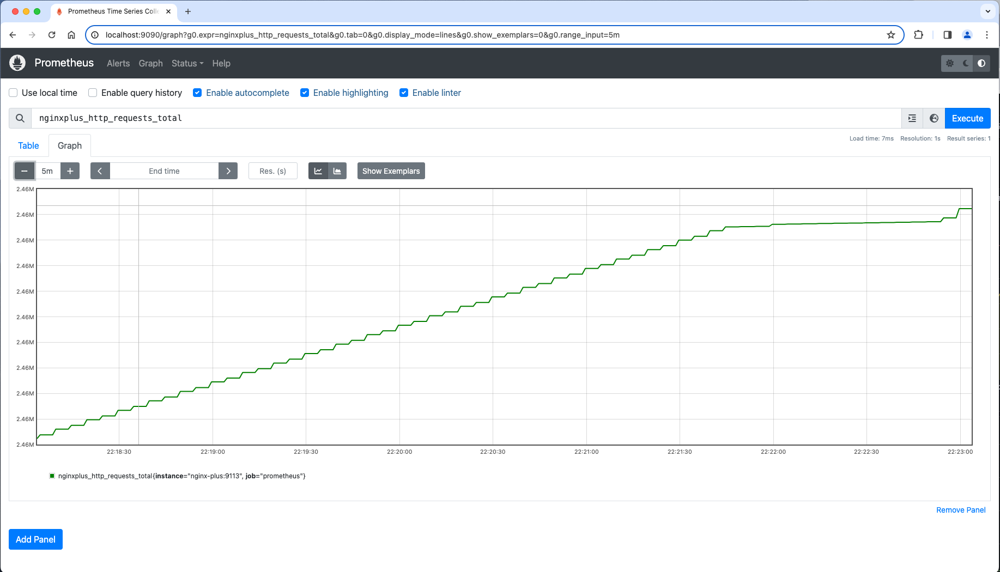
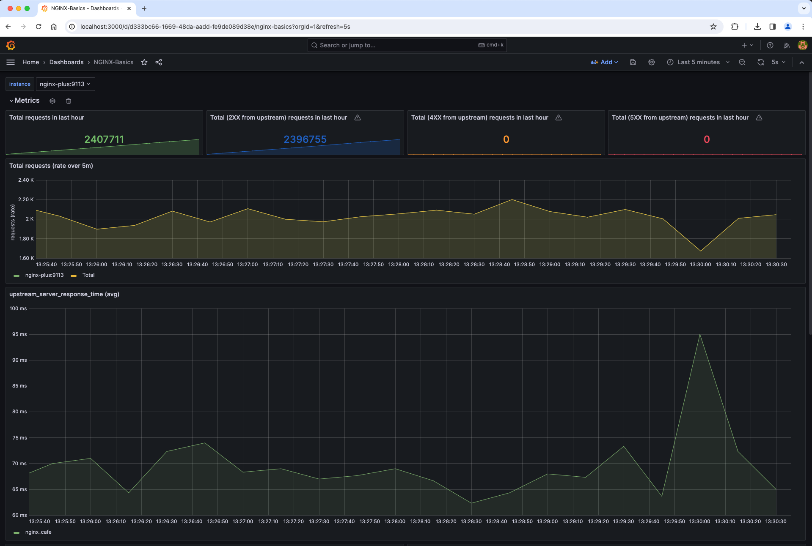

# Prometheus와 Grafana를 이용한 NGINX+ 모니터링

## 소개

이번 랩에서는 최근 많이 사용하는 오픈소스 모니터링 솔루션인 Prometheus 및 Grafa를 활용해서 NGINX+(NGINX OSS도 해당) 모니터링을 실습 합니다.  


이 솔루션을 사용하려면 NGINX+에서 제공하는 Javascript 및 Prometheus 모듈을 사용하여 NGINX+ API를 통해 메트릭 정보를 수집하고 해당 메트릭을 게시용 통계를 스크랩하기 때문에 일반적으로 `scaper page`(스케이퍼 페이지)로 명시되는 HTTP html/text 페이지로 내보내야 합니다.


그런 다음 이 내보내기 페이지의 메트릭을 읽고 Prometheus 및 Grafana의 시계열 데이터베이스로 가져옵니다. 이러한 지표가 데이터베이스에 있으면 시각화 및 보고를 위한 다양한 대시보드, 임계값, 경고 및 기타 유형의 그래프를 생성할 수 있습니다.


이미 잘 알고 있겠지만 NGINX에는 사용자가 생성하고 무료로 사용해 볼 수 있는 수백 개의 Grafana 대시보드가 있습니다. Grafana를 사용하면 자신만의 대시보드를 만들고 편집할 수 있습니다.

NGINX+ | Prometheus | Grafana
:-------------------------:|:-------------------------:|:-----:
  | |
  
## 학습목표

실습을 마치면 다음을 수행할 수 있습니다.

- NGINX Java Script 활성화 및 설정
- Prometheus 내보내기 설정
- Prometheus 서버 사용
- Grafana 서버 사용
- Grafana 대시보드의 보기 및 활용

## 사전 요구사항

- 서버(랩용)에 Docker가 설치되고 실행 중이어 합니다.
- Docker-compose가 설치되어 있어야 합니다.
- NGINX+ 라이선스 또는 평가판/구독이 필요 합니다.
- 이 워크샵을 위한 시스템 설정 지침은 `Lab0`을 참조하세요. 
- 기본 Linux 명령 및 명령줄 도구에 대한 이해가 필요합니다.
- Docker의 기본 개념과 명령어에 대한 이해가 필요합니다.
- 기본적인 HTTP 프로토콜에 대한 이해가 필요합니다.
- Prometheus에 대한 기본 지식이 필요합니다.
- Grafana에 대한 기본 지식이 필요합니다.

As part of your Dockerfile, your NGINX Plus container already has the added `NGINX Java Script and NGINX Prometheus dynamic module` installed during the build process.  Refer to the Dockerfile if you want to check it out.

Dockerfile의 일부로 NGINX+ 컨테이너에는 빌드 프로세스 중 NGINX Java Script 및 NGINX Prometheus 동적 모듈이 이미 추가되어 있기 때문에 확인이 필요하시면 Dockerfile의 내용을 참조하세요.

1. `lab6`폴더에서 시작을 할 수 있기 때문에 현재 디렉토리가 `lab6`에 있는지 확인하세요. 터미널을 사용하여 Docker Compose를 실행하여 모든 컨테이너를 빌드하고 실행 합니다. 

    ```bash
     cd lab6
     docker compose up --force-recreate -d
    ```

1. `nginx.conf`파일에서 아래와 같이 2개의 주석으로 처리된 내용을 주석제거를 통해 활성화 합니다.

    - `ngx_http_js_module` 활성화를 위해 라인 #8의 주석을 제거 합니다.
    - #37라인의 주석을 제거하여 `subrequest_output_buffer_size` 라는 내용의 NGINX 버퍼 파라메터를 활성화 합니다.

    ```nginx
    ...snip

    user  nginx;
    worker_processes  auto;

    error_log  /var/log/nginx/error.log info;
    pid        /var/run/nginx.pid;

    # Uncomment to enable NGINX JavaScript module
    load_module modules/ngx_http_js_module.so;   # Added for Prometheus

    ...snip

        # Uncomment for Prometheus scraper page output
        subrequest_output_buffer_size 32k;       # Added for Prometheus

    ...snip

    ```

1. Inspect the `prometheus.conf` file in the `labs/lab6/nginx-plus/etc/nginx/conf.d` folder.  This is the NGINX config file which opens up port 9113, and provides access to the scraper page.  Uncomment all the lines to enable this.

    ```nginx
    # NGINX Plus Prometheus configuration, for HTTP scraper page
    # Chris Akker, Shouvik Dutta - Feb 2024
    # https://www.nginx.com/blog/how-to-visualize-nginx-plus-with-prometheus-and-grafana/
    # Nginx Basics
    #
    # Uncomment all lines below
    js_import /usr/share/nginx-plus-module-prometheus/prometheus.js;

    server {
    
        listen 9113;               # This is the default port for Prometheus scraper page
        
        location = /metrics {
            js_content prometheus.metrics;
        }

        location /api {
            api;
        } 

    }

    ```

1. Once the contents of both files has been updated and saved, Docker Exec into the nginx-plus container.

    ```bash
     docker exec -it nginx-plus bin/bash
    ```

1. Test and reload your NGINX config by running `nginx -t` and `nginx -s reload` commands respectively from within the container.

1. Start the WRK load generation tool.  This will provide some traffic to the nginx-plus container, so the statistics will be increasing.

    ```bash
    docker run --name wrk --network=lab6_default --rm williamyeh/wrk -t4 -c200 -d20m -H 'Host: cafe.example.com' --timeout 2s http://nginx-plus/coffee
    ```

1. Test the Prometheus scraper page.  Open your browser to <http://localhost:9113/metrics>.  You should see an html/text page like this one.  You will notice there are MANY statistcs available, this page is like a text version of the NGINX Plus dashboard. This page can be easily imported into your existing Performance Management and Monitoring tools.  You will see how to do this in the next section with Prometheus and Grafana.

    Click refresh a couple times, and some of the metrics should increment.

    

<br/>

## Prometheus and Grafana Server Docker containers

<br/>

  |
--- | ---

1. Inspect your `docker-compose.yml` file, you will see it includes 2 additional Docker containers for this lab, one for a Prometheus server, and one for a Grafana server.  These have been configured to run for you, but the images will be pulled from public repos.

    ```bash
    ...snip
    
    prometheus:
        hostname: prometheus
        container_name: prometheus
        image: prom/prometheus
        volumes:
            - ./nginx-plus/etc/prometheus/prometheus.yml:/etc/prometheus/prometheus.yml
        ports:
            - "9090:9090"
        restart: always
        depends_on:
            - nginx-plus
    grafana:
        hostname: grafana
        container_name: grafana
        volumes:
            - grafana-storage:/var/lib/grafana
        image: grafana/grafana
        ports:
            - "3000:3000"
        restart: always
        depends_on:
            - nginx-plus
    volumes:
    grafana-storage:
        name: "grafana-storage"
        external: false

    ```

1. Verify these 2 containers are running.

    ```bash
    docker ps -a
    ```

    ```bash
    ##Sample output##
    CONTAINER ID   IMAGE                   COMMAND                  CREATED          STATUS          PORTS                                                                                      NAMES
    8a61c66fc511   prom/prometheus         "/bin/prometheus --c…"   36 minutes ago   Up 36 minutes   0.0.0.0:9090->9090/tcp                                                                     prometheus
    4d38710ed4ec   grafana/grafana         "/run.sh"                36 minutes ago   Up 36 minutes   0.0.0.0:3000->3000/tcp                                                                     grafana

    ...snip

    ```

<br/>

### Prometheus

<br/>

Prometheus is a software package that can watch and collect statistics from many different NGINX instances. The Prometheus server will collect the statistics from the scraper page that you enabled in the previous section.

<br/>

1. Using Chrome, navigate to <http://localhost:9090>. You should see a Prometheus webpage like this one. Search for `nginxplus_` in the query box to see a list of all the statistics that Prometheus is collecting for you.  Select `nginxplus_http_requests_total` from the list, click on Graph, and then click the "Execute" Button.  Change the Time window if needed. This will provide a graph similar to this one:

    

    Take a few minutes to explore other metrics available from NGINX Plus.  What is the Upstream Response Time of your 3 backend web servers???

<br/>

### Grafana

<br/>

Grafana is a data visualization tool, which contains a time series database and graphical web presentation tools. Grafana imports the Prometheus scraper page statistics into it's database, and allows you to create Dashboards of the statistics that are important to you.

1. Log into the Web console access for Grafana at <http://localhost:3000>.  The default Login should be user/pass of `admin/admin`.  This will present the main Grafana page.

1. Create a Prometheus Data Source.  In the middle of the Grafana Welcome page, click on `Add Data Source`, and Select the Prometheus icon.

1. Set the Connection URL to `http://prometheus:9090` as shown:

    

1. Scroll to the bottom and click `Save and Test`. You should see a green `Successfully queried the Prometheus API` message.

1. Import the provided `labs/lab6/NGINX-Basics.json` file to see statistics like the NGINX Plus HTTP Requests Per Second and Upstream Response Times.  Click on Create New Dashboard from Home page and then Import.  Copy and Paste the `labs/lab6/NGINX-Basics.json` file provided. Click on the `Load` button. Set the data source to `prometheus` and then click on the `Import` button. You should see a dashboard like this one:

    

    There are many different Grafana Dashboards available, and you have the option to create and build dashboards to suite your needs.  NGINX Plus provides over 240 metrics for TCP, HTTP, SSL, Virtual Servers, Locations, Rate Limits, and Upstreams.

> If `wrk` load generation tool is still running, then you can stop it by pressing `ctrl + c`.

>If you are finished with this lab, you can use Docker Compose to shut down your test environment. Make sure you are in the `lab6` folder:

```bash
cd lab6
docker compose down
```

```bash
##Sample output##
Running 5/5
Container nginx-plus         Removed
Container web2               Removed
Container prometheus         Removed
Container web3               Removed
Container web1               Removed
Container grafana            Removed                            
Network lab6_default         Removed

```

<br/>

**This completes Lab6.**

<br/>

## References:

- [NGINX Plus](https://www.nginx.com/products/nginx/)
- [NGINX Admin Guide](https://docs.nginx.com/nginx/admin-guide/)
- [NGINX Technical Specs](https://docs.nginx.com/nginx/technical-specs/)
- [NGINX Prometheus Exporter Metrics](https://github.com/nginxinc/nginx-prometheus-exporter?tab=readme-ov-file#exported-metrics)

<br/>

### Authors

- Chris Akker - Solutions Architect - Community and Alliances @ F5, Inc.
- Shouvik Dutta - Solutions Architect - Community and Alliances @ F5, Inc.

-------------

Navigate to ([Main Menu](../readme.md))